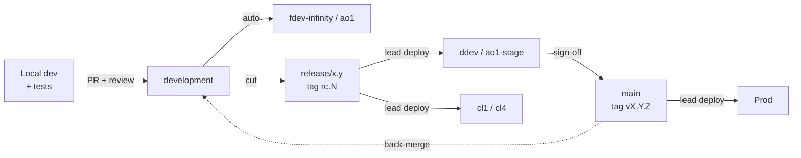

# Proposal: Branching, Environments & Release Discipline

Sep 23, 2026 · @Praveen

## Summary

We propose one enforced path from laptop to production: develop and verify in fdev-infinity (non-credit) and ao1 (credit), do full testing only from release branches in the stage environments, and let only leads deploy to stage, demo and prod.

**What's wrong today**

- Developers skip the process: direct pushes, thin PRs, and untested code reaching shared environments.
- No tags, so we can't say with certainty which version is running in stage, demo or prod.
- Anyone can deploy anywhere, which makes stage and demo unstable and breaks demos at the worst moment.
- Images get built before code is verified locally, wasting CI time and polluting the registry.

**What we're asking leads to agree to**

1. Keep our existing model (`main`, `development`, `feature/*`, release cut from `development`) and add tags, hotfix rules and release branches as the only source for stage and demo.
2. Enforce it in tooling (branch protection, deploy approvals, CI-only image builds), not by reminders.
3. Own the higher-environment deploys and hold the line on PR quality for the first month.

## Principles

Every rule below follows from six best practices.

1. **Build once, deploy many.** One immutable image, identified by commit SHA or version tag, moves from dev to stage to prod. We never rebuild for a higher environment.
2. **Branches are for code, not environments.** Environment differences live in config and secrets injected at deploy time, never in branch-specific code.
3. **Every change goes through a PR.** No direct commits to `development`, `release/*` or `main`, including for leads.
4. **Verify before you share.** Code is tested locally before it's pushed, and in dev environments before it reaches stage.
5. **Traceability by default.** Every deployed artifact maps to a tag, a PR and a ticket. For credit, that trail is an audit requirement, not a nicety.
6. **Guardrails over goodwill.** If a rule matters, the tooling enforces it. If it's only written down, assume it's optional.

## Branching model

We keep our current model and tighten it: two permanent branches and four short-lived types, each with one purpose and one merge target.

| Branch | Created from | Merges into | Lifetime | Deploys to |
| --- | --- | --- | --- | --- |
| `feature/<TICKET>-<desc>` | `development` | `development` via PR | 1–5 days | Local only |
| `bugfix/<TICKET>-<desc>` | `development` | `development` via PR | 1–3 days | Local only |
| `development` | — | — | Permanent | fdev-infinity, ao1 |
| `release/<x.y>` | `development` | `main`, then back to `development` | Until release ships | ddev, ao1-stage, cl1, cl4 |
| `hotfix/<TICKET>-<desc>` | Latest `main` tag | `main`, then back to `development` | Hours to 2 days | Stage, then prod |
| `main` | — | — | Permanent | Prod (tagged only) |

**Rules**

- Branch names must include a ticket ID; the push is rejected otherwise (pattern: `^(feature|bugfix|hotfix|release)/[A-Z]+-\d+.*` or `release/\d+\.\d+`).
- Feature branches are rebased on `development` before the PR and deleted after merge.
- Once a release branch is cut, only fixes go into it. New features wait for the next cut.
- Every fix on a release branch is merged back to `development` in the same week, so fixes are never lost.
- `main` only receives merges from `release/*` and `hotfix/*`.

## Environments

Dev environments are for developer verification; stage is for full testing of a release candidate; demo shows only released or candidate builds.

| Env | Track | Purpose | Deploys from | Who deploys |
| --- | --- | --- | --- | --- |
| fdev-infinity | Non-credit | Integration and dev testing | `development` | Auto on merge |
| ao1 | Credit | Integration and dev testing | `development` | Auto on merge (credit paths need credit lead PR approval) |
| ddev | Non-credit | Full regression, UAT | `release/*` RC tag | Leads only |
| ao1-stage | Credit | Full regression, UAT, compliance checks | `release/*` RC tag | Leads only, with change ticket |
| cl1 | Demo | Latest release candidate | RC tag | Leads only |
| cl4 | Demo | Last stable release | Release tag | Leads only |
| Prod | Both | Customers | `main` release tag | Leads, with change approval |

**Rules**

- Feature branches never deploy to shared environments. If something needs a shared environment to test, it merges to `development` behind a feature flag.
- Stage and demo only run images that were already built and verified in dev. No rebuilds.
- Credit environments use their own secrets and service accounts, and ao1 never holds production credit data.
- A broken fdev-infinity or ao1 is the team's top priority: fix forward or revert the offending merge within the day.

## Ideal release paths

Every change follows one of three paths, and each step has a gate that must pass before the next.



The image built for the RC tag is the same image that reaches prod.

**1. Standard release**

1. Developer branches `feature/ABC-123-...` from `development`, builds and tests locally.
2. PR to `development`: CI passes, one approval (credit lead for credit paths), squash merge.
3. CI builds the image once and auto-deploys to fdev-infinity and ao1. The developer verifies there.
4. At release cut, a lead creates `release/x.y` from `development`, and CI tags `vX.Y.0-rc.1`.
5. A lead deploys the RC image to ddev and ao1-stage for full regression and UAT. Fixes go on the release branch as new RCs (`rc.2`, `rc.3`).
6. A lead deploys the approved RC to cl1 for demos.
7. After QA and product sign-off, the release branch merges to `main`. CI tags `vX.Y.0` on the same commit and image.
8. A lead deploys `vX.Y.0` to prod, then to cl4. `main` is back-merged into `development`.

**2. Hotfix**

1. A lead creates `hotfix/ABC-456-...` from the current prod tag.
2. PR with two approvals, CI tags `vX.Y.1-rc.1`, and a lead deploys it to the stage env for the affected track.
3. After a focused test, merge to `main`, tag `vX.Y.1`, deploy to prod.
4. Merge back to `development` (and any open `release/*`) the same day.

**3. Credit-impacting changes**

Same as the standard path, with extra gates:

- A credit lead approves the PR (CODEOWNERS on credit modules).
- ao1-stage deploys need a linked change ticket.
- Compliance and data checks pass in ao1-stage before the merge to `main`.
- The deploy record (who, what tag, when, ticket) is retained for audit.

**Demo environments**

cl1 shows the newest approved RC; cl4 shows the last production release. Neither ever runs a feature branch or an untagged build, and a demo freeze (no deploys 24 hours before a scheduled demo) is requested through the leads.

## Tagging and versioning

The pipeline creates every tag automatically using semantic versioning; nobody tags by hand.

| Tag | Created when | Example | Used for |
| --- | --- | --- | --- |
| Commit SHA | Every merge to `development` | `sha-3f2a9c1` | fdev-infinity, ao1 images |
| Release candidate | Each build on `release/*` | `v2.4.0-rc.3` | ddev, ao1-stage, cl1 |
| Release | Merge of `release/*` to `main` | `v2.4.0` | Prod, cl4 |
| Hotfix | Merge of `hotfix/*` to `main` | `v2.4.1` | Prod, cl4 |

- **Major** for breaking API or contract changes, **minor** for a normal release, **patch** for hotfixes.
- The Git tag and the image tag are identical, so anyone can see exactly what's running in any environment.
- Tags are protected: they can't be moved or deleted.
- Conventional commit messages (`feat:`, `fix:`, `chore:`) let the pipeline suggest the next version and generate release notes. For Python services, `python-semantic-release` can do both.

## Pull requests and local testing

A PR is ready for review only when it's small, linked to a ticket, and shows evidence it was tested locally.

**PR standards**

- One ticket, one purpose. Aim for under 400 changed lines; split anything larger.
- Title format: `ABC-123: short description`.
- Draft PRs for work in progress; reviewers only pick up PRs marked ready.
- Reviewers respond within one business day. Authors address or answer every comment before merge.
- Squash merge into `development` so each ticket is one commit.

**Required PR template**

```markdown
## Ticket
ABC-123

## What changed and why

## Credit impact
- [ ] No  - [ ] Yes (credit lead review required)

## How I tested locally
Commands run and results (e.g. make test, make run-local)

## Verified in
- [ ] fdev-infinity  - [ ] ao1  - [ ] Not yet (explain)

## Rollback plan
```

**Local testing before any image is built**

1. Pre-commit hooks run on every commit: `ruff` (lint and format), `mypy`, `gitleaks` (secrets), and fast unit tests (`pytest -m unit`).
2. One command to test everything: `make test` runs the same checks CI runs.
3. One command to run the service: `make run-local` starts it with dependencies via docker compose.
4. Images are never built or pushed from laptops for shared environments. CI builds them only after lint and tests pass.

We can't force anyone to test locally, but CI reruns the same checks. Skipping them locally just means waiting on a red build, which is usually enough to change habits.

## Enforcement guardrails

Each rule in this proposal is backed by a technical control, so compliance doesn't depend on memory or goodwill.

| Rule | Control |
| --- | --- |
| No direct commits to shared branches | Branch protection on `development`, `release/*`, `main`: PR required, force-push blocked, applies to admins |
| Reviews happen | 1 approval for `development`, 2 for `main` and `hotfix/*`; stale approvals dismissed on new commits |
| Credit changes get credit review | CODEOWNERS on credit modules requires a credit lead |
| Code is tested | Required CI checks: lint, type check, unit and integration tests, secret and dependency scans |
| Branch names carry a ticket | Push rule or CI check rejects non-matching names |
| Only leads deploy to stage, demo, prod | Protected environments with a leads approval group; deploy credentials exist only in the pipeline |
| Stage and demo run release builds only | Deploy jobs for those environments run only from `release/*` refs or tags |
| No laptop-built images | Only the CI service account can push to the registry |
| Tags are trustworthy | Tags created by the pipeline; tag protection prevents edits or deletes |
| Branches stay short-lived | Merged branches auto-deleted; weekly report of branches older than 5 days |

## Roles and responsibilities

Developers own quality up to fdev-infinity and ao1; leads own everything from the release cut onward.

| Activity | Developer | Lead | Credit lead | QA |
| --- | --- | --- | --- | --- |
| Local testing and PR evidence | Responsible | Checks in review | Checks in review | — |
| PR approval to `development` | — | Approves | Approves credit paths | — |
| Verify in fdev-infinity / ao1 | Responsible | Informed | Informed | — |
| Cut `release/*` | — | Responsible | Informed | Informed |
| Deploy to ddev / ao1-stage | — | Responsible | Approves ao1-stage | Informed |
| Full regression and UAT | Supports fixes | Accountable | Accountable for credit | Responsible |
| Deploy to cl1 / cl4 | — | Responsible | — | — |
| Merge to `main` and prod deploy | — | Responsible | Approves credit releases | Signs off |
| Back-merge to `development` | — | Responsible | — | — |

## Rollout plan

We roll this out over four weeks so the team adjusts before the controls get strict.

| Week | Step |
| --- | --- |
| 1 | Leads review and agree this proposal; share it with the team in a 30-minute walkthrough |
| 2 | Add PR template, pre-commit config, `make test` / `make run-local`; turn on automated tagging |
| 3 | Enable branch protection, CODEOWNERS, protected environments and CI-only registry push |
| 4 | Full enforcement: non-compliant PRs are returned, no exceptions for the first month |

**How we'll measure success**

- Direct pushes to shared branches: zero (blocked by tooling).
- PRs merged with test evidence and a ticket: 100%.
- Deploys to stage, demo and prod with a matching tag: 100%.
- CI failing on first push: trending down month over month.
- Unplanned breakage in ddev, ao1-stage or demos: trending down.

**Open questions**

- [ ] Which CI/CD platform and registry do we configure first?
- [ ] Who is in the leads approval group, and who are the credit leads for CODEOWNERS?
- [ ] What is the release cadence (for example, every two weeks)?
- [ ] Is feature flagging tooling available for changes that span both tracks?
