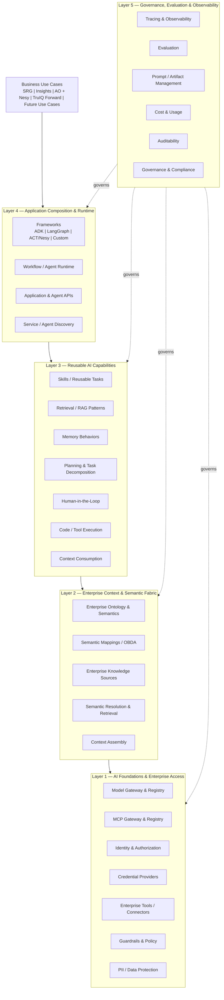
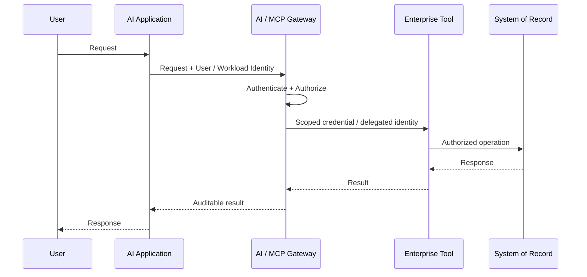
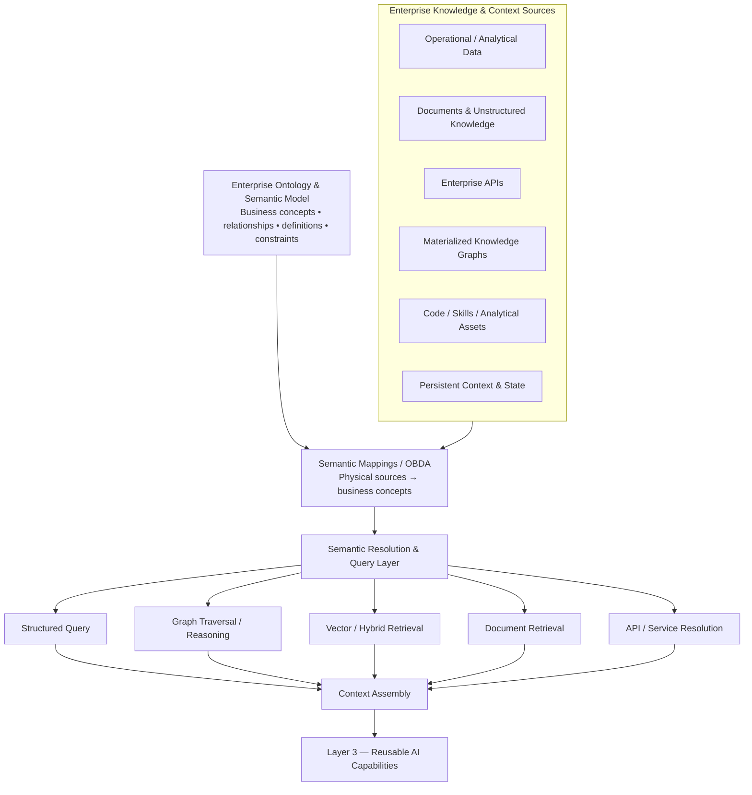
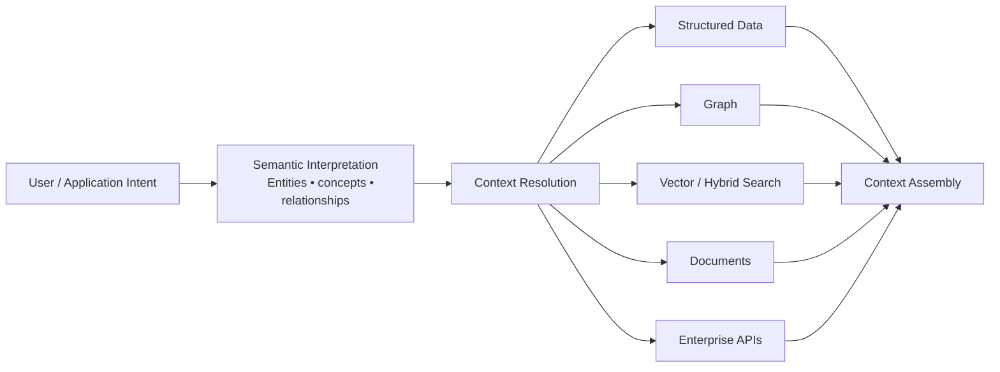
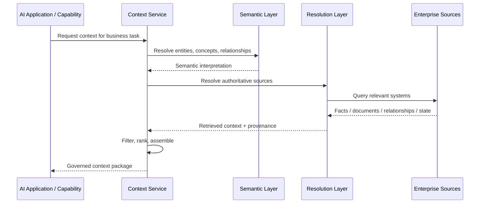
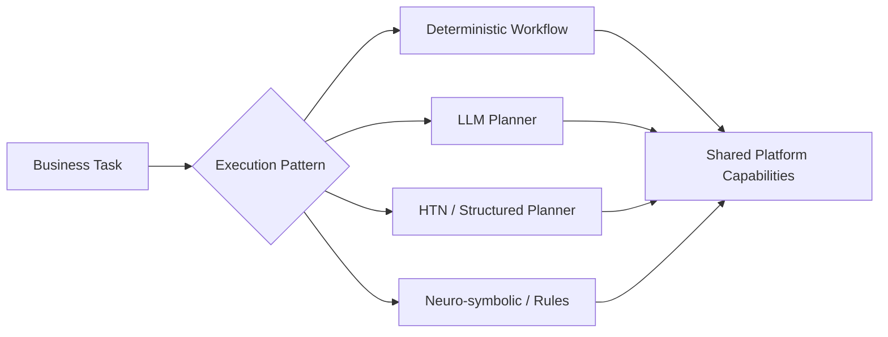
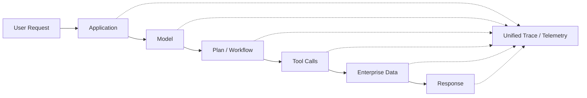
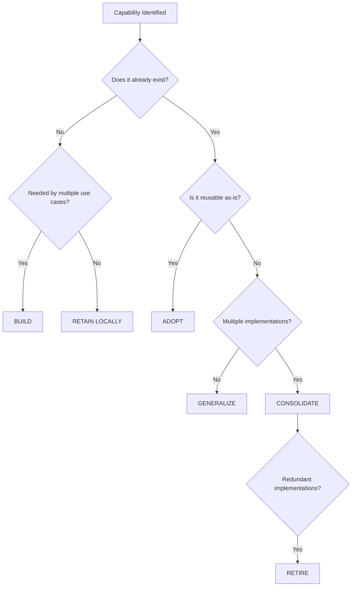
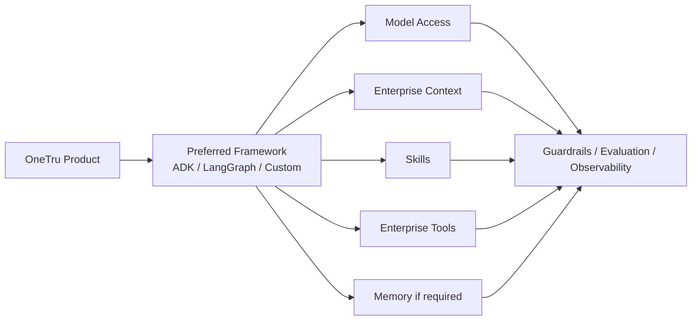
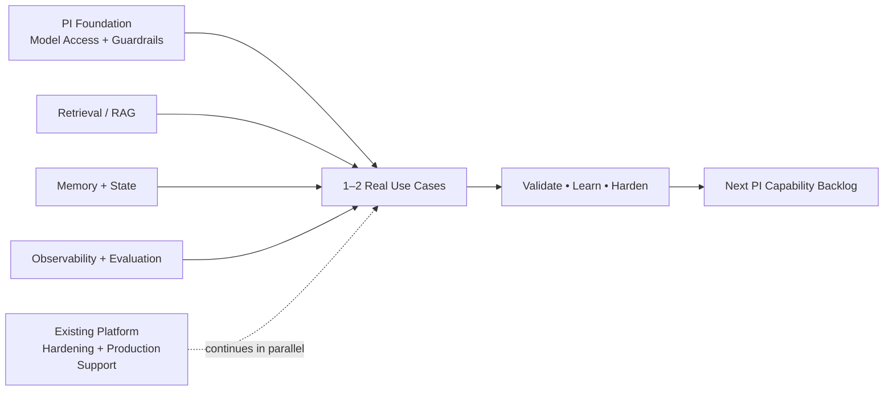

# Chapter 1 — AI Platform Capability Architecture

## 1. Purpose

The enterprise does not need another general-purpose agent framework. It needs a common set of AI capabilities that product teams can compose to deliver business outcomes without independently rebuilding identity, model access, context, memory, tools, evaluation, guardrails, and operational controls for every use case.

This chapter defines the **target AI Platform capability architecture** and establishes a common vocabulary for evaluating what already exists across the organization.

The intent is to answer four questions:

- What capabilities are required to support the continuum of AI use cases we are seeing today?
- Which capabilities should be provided once as shared enterprise building blocks?
- Which capabilities should remain implementation choices owned by individual applications?
- Where should we **adopt, generalize, build, consolidate, retain, or retire** existing capabilities?

The architecture deliberately separates **enterprise platform primitives** from **application frameworks and use-case implementations**.

> **Standardize the enterprise capabilities beneath AI applications while allowing teams to compose them using the framework and execution model best suited to the use case.**

---

## 1.1 Architecture Principles

### Business outcomes drive platform capabilities

We should not create capabilities simply because a framework happens to expose them.

A platform primitive should generally exist because it solves a recurring enterprise problem across multiple use cases, such as authentication, enterprise context, memory, model access, tool invocation, evaluation, or policy enforcement.

The known use cases — **SRG, Insights, AO + Nesy, TruIQ Forward, and future OneTru use cases** — become the validation mechanism for the architecture.

### Converge capabilities, not necessarily frameworks

Applications may use:

- ADK
- LangGraph
- ACT / Nesy
- deterministic workflows
- direct LLM APIs
- traditional applications with embedded AI
- future frameworks we have not selected yet

The platform should not require teams to rewrite applications simply to consume enterprise capabilities.

Instead, platform primitives should expose stable interfaces through APIs, SDKs, MCP, events, or other interoperable contracts.

### Generalize what is proven

Several useful capabilities already exist inside existing solutions.

The default sequence should be:

**Discover → Assess → Generalize → Reuse**

rather than:

**Design another platform → Rebuild → Migrate everything**

### Keep business logic with the business application

The platform should provide reusable infrastructure and AI primitives.

It should not own:

- product-specific prompts
- use-case-specific workflow logic
- domain decisions
- business approval rules
- application-specific user experiences

These remain the responsibility of the consuming product.

### Prefer composability over abstraction

A developer should be able to select only the capabilities needed for a use case without adopting the entire platform stack.

For example, a product could consume:

**Model Gateway + Credential Provider + MCP + Guardrails + Evaluation**

without needing:

**Memory + Planning + Agent Registry + LangGraph + Nesy**

This is an important architectural boundary.

### Centralize meaning, federate facts

The enterprise should have a common semantic foundation without forcing all enterprise data into one physical store.

The platform should centralize business meaning through ontology and semantics, while allowing facts to remain in the systems that own them.

---

## 1.2 Target Capability Architecture

The target architecture consists of five logical layers.



Although represented as Layer 5, governance, evaluation, and observability are **cross-cutting capabilities spanning the entire architecture**.

---

## 1.3 Layer 1 — AI Foundations & Enterprise Access

### Purpose

Layer 1 provides the secure enterprise boundary between AI applications and models, tools, and enterprise systems.

These capabilities should largely be independent of whichever agent framework or workflow engine an application chooses.

> **Models, enterprise tools, credentials, identity, and policy should be solved once — not separately inside every AI application.**

### Model Gateway

Provides a common interface for accessing approved foundation models.

Responsibilities include:

- provider abstraction
- approved model catalog
- model routing
- authentication
- quotas
- rate limiting
- usage tracking
- model policy enforcement
- fallback strategies where appropriate
- cost attribution

The gateway should not attempt to abstract away all differences between models. Applications should still be able to intentionally select capabilities such as reasoning models, multimodal models, embeddings, or smaller task-specific models.

### Model Registry

The registry complements the gateway by describing:

- approved models
- model owners
- supported use cases
- data classifications
- region availability
- context limits
- cost characteristics
- lifecycle status
- evaluation results

### MCP Gateway & Registry

MCP should provide a standardized mechanism for exposing enterprise capabilities to AI applications.

#### MCP Registry

Provides discovery and metadata:

- approved MCP servers
- ownership
- available tools
- endpoints
- lifecycle state
- required permissions
- business purpose
- data classification

#### MCP Gateway

Provides the managed execution boundary:

- authentication
- authorization
- policy enforcement
- tool invocation
- routing
- telemetry
- quotas
- potentially protocol translation

Individual applications should not need to independently solve enterprise access controls every time they consume an MCP tool.

### Enterprise Tooling and Connectors

Reusable connectors should expose systems such as:

- enterprise data platforms
- knowledge systems
- document repositories
- workflow systems
- APIs
- analytics platforms
- transaction systems

These are not necessarily all platform-owned implementations.

The platform's role is to create a **consistent consumption and governance model** around them.

### Identity and Authorization

AI workloads need first-class identity.

This includes:

- user identity propagation
- workload / agent identity
- service-to-service identity
- delegated access
- authorization
- policy evaluation

A request should remain attributable to an identity throughout the execution chain:



This becomes increasingly important as systems move from read-only retrieval toward actions.

### Credential Providers

Credentials should not be hard-coded or independently managed inside AI applications.

Credential providers should support:

- secret retrieval
- short-lived credentials
- token exchange
- user delegation
- service identity
- credential rotation

The credential capability should be consumable independently by frameworks, MCP servers, workflow engines, and applications.

### Guardrails & Policy Enforcement

Guardrails provide centralized enforcement for concerns such as:

- prohibited content
- sensitive-data handling
- prompt injection protections
- enterprise policy
- model usage restrictions
- tool restrictions

Not every guardrail belongs at the same point.

Some policies may be enforced:

- before model invocation
- after model output
- before tool invocation
- at data access
- at application boundaries

The architecture should therefore treat guardrails as a **policy capability**, not simply a prompt filter.

### PII and Data Protection

Shared protection mechanisms may include:

- PII detection
- redaction
- tokenization
- reinsertion
- data classification
- residency controls
- sensitive-data policy

These controls should be applied as close as practical to the enterprise boundary rather than left entirely to application developers.

---

# 1.4 Layer 2 — Enterprise Context & Semantic Fabric

## Purpose

Foundation models provide general intelligence. Enterprise value comes from grounding that intelligence in the **right business meaning, enterprise facts, relationships, operational state, and governed context**.

Layer 2 provides the semantic backbone through which AI applications understand, discover, retrieve, relate, and assemble enterprise context across heterogeneous systems.

> **Enterprise context is not a vector database. It is the governed combination of business meaning, enterprise facts, relationships, provenance, and state required to perform a task correctly.**

The core architectural principle for this layer is:

> **Centralize meaning; federate facts.**

The enterprise semantic model should provide a shared interpretation of business concepts, while the underlying facts remain in the systems that own them.

---

## 1.4.1 Why Ontology & Semantics Are the Backbone

Ontology and semantics should not be treated as one capability beside vector search, graph, or memory.

They provide the **organizing model for the entire enterprise context layer**.

Enterprise data frequently represents the same business concepts differently across systems:

- different names
- different schemas
- different identifiers
- different regional representations
- different physical storage models

Without a semantic foundation, every AI application must independently understand those differences.

The ontology provides a shared model of:

- business concepts
- entities
- attributes
- relationships
- hierarchies
- taxonomies
- domain vocabulary
- constraints
- synonyms
- provenance
- ownership

For example, rather than requiring an application to understand fields such as:

`acct_id`, `customer_num`, `region_cd`, `prod_type`

the semantic model exposes concepts such as:

**Customer → owns Account → Account belongs to Region → Account is associated with Product**

The objective is not to create an ontology for the sake of modeling. It is to give AI applications a stable, enterprise-level interpretation of business concepts independent of underlying physical systems.

---

## 1.4.2 Semantic Architecture



The semantic model provides meaning.

Mappings connect that meaning to physical enterprise systems.

Resolution mechanisms retrieve the appropriate facts.

Context assembly converts the results into governed, task-relevant context for downstream AI capabilities.

---

## 1.4.3 Enterprise Ontology & Semantic Model

The enterprise ontology defines the shared meaning of important business concepts.

It can include:

- canonical entities
- relationships
- business definitions
- domain terminology
- hierarchies
- classification
- constraints
- synonyms
- regional specialization
- semantic ownership

The platform should support both:

### Enterprise-level concepts

Concepts that should have stable meaning across domains.

Examples:

- Customer
- Product
- Account
- Organization
- Region
- Business Entity

### Domain-level semantic models

More specialized concepts managed closer to the domain.

Examples:

- Credit Attribute
- Risk Signal
- Inquiry
- Trade Line
- Analytical Feature

The intent is not necessarily to create one massive centrally managed ontology.

A federated model can allow domain semantics while maintaining alignment around shared enterprise concepts.

---

## 1.4.4 Centralize Meaning, Federate Facts

The semantic model should not become a requirement to copy all enterprise data into one graph.

The preferred pattern is:

```text
Business Meaning
      ↓
Ontology / Semantic Model
      ↓
Semantic Mapping
      ↓
Existing Systems of Record
```

Facts may continue to live in:

- operational databases
- data products
- warehouses
- APIs
- document stores
- graph databases
- vector stores
- workflow systems

This avoids creating another enterprise data replication layer simply to support AI.

It also allows each system to remain authoritative for the facts it owns.

---

## 1.4.5 Semantic Mapping / OBDA

Ontology alone does not tell the platform where actual data lives.

A first-class semantic mapping capability connects business concepts to physical enterprise sources.

Mappings describe relationships such as:

```text
Customer.customerId
    → customer_master.customer_number

Account.accountType
    → account_data.account_type_cd

Region
    → enterprise_region_service

Product
    → product_master.product_id
```

This capability may use **Ontology-Based Data Access (OBDA)** or similar semantic mapping patterns.

Responsibilities include:

- physical schema → semantic concept mapping
- property mapping
- identifier mapping
- relationship mapping
- source registration
- source ownership
- provenance
- versioning
- mapping validation

The semantic model can then remain relatively stable even when underlying systems evolve.

---

## 1.4.6 Semantic Resolution

Once concepts and mappings exist, the platform needs a way to resolve business intent into the appropriate sources and access mechanism.

For example:

> "Show the active products associated with this customer's open accounts."

The resolution layer determines:

1. What does **Customer** mean?
2. What does **Account** mean?
3. Which relationship represents ownership?
4. What constitutes **active**?
5. Which systems are authoritative?
6. Which access mechanism should be used?
7. Which permissions apply?

The resulting query may involve:

- SQL
- graph traversal
- APIs
- document retrieval
- vector search
- multiple sources combined

This moves source-specific integration complexity away from the consuming AI application.

---

## 1.4.7 Knowledge Graphs

A knowledge graph can be a valuable execution and access pattern, but it should not be confused with the semantic model itself.

The distinction is:

### Ontology / Semantic Model

Defines:

- concepts
- relationships
- constraints
- meaning

### Knowledge Graph

Contains or materializes:

- entity instances
- relationships between instances
- graph-optimized projections of enterprise facts

For example:

**Ontology**

```text
Customer → owns → Account
Account → associatedWith → Product
```

**Knowledge graph instance**

```text
Customer123 → Account789 → Product456
```

Depending on the use case, those relationships might be:

- materialized in Neo4j
- virtually exposed from relational systems
- resolved dynamically from APIs
- partly materialized and partly federated

Therefore:

> **Graph is one mechanism for accessing semantically modeled enterprise context — not the semantic backbone itself.**

---

## 1.4.8 Structured Enterprise Data

Many enterprise AI questions require precise structured facts rather than probabilistic retrieval.

Examples:

- What accounts are currently open?
- What is the customer's current balance?
- Which attributes are associated with this product?
- What region does this account belong to?
- Which policies apply to this entity?

The context layer should therefore support governed access to structured data through:

- semantic SQL
- query federation
- APIs
- data products
- graph projections

Vector retrieval should not be the default access pattern for facts that already exist in structured systems.

---

## 1.4.9 Documents & Unstructured Knowledge

Enterprise knowledge also exists in:

- policies
- procedures
- product documentation
- contracts
- support content
- research
- operational guidance

The semantic layer should allow those sources to be associated with enterprise concepts.

For example:

```text
Policy Document
    appliesTo
Product

Procedure
    governs
Workflow

Research Note
    references
Customer Segment
```

This allows retrieval to incorporate business relationships rather than relying exclusively on lexical or vector similarity.

---

## 1.4.10 Vector & Hybrid Retrieval

Vector search remains an important mechanism within the context architecture, especially for unstructured content.

Shared retrieval capabilities may include:

- embedding generation
- vector indexing
- semantic search
- metadata filtering
- hybrid search
- reranking

However:

> **RAG is one retrieval mechanism inside Enterprise Context — it is not Enterprise Context itself.**

Semantics can improve retrieval by helping determine:

- which entity is being discussed
- which domain applies
- which source is authoritative
- which metadata filters should be used
- which relationships should be traversed
- which retrieval method is appropriate

A semantically informed retrieval flow may look like:



---

## 1.4.11 Entity Resolution

Enterprise systems may contain multiple identifiers or representations for the same underlying entity.

Examples include:

- customer identifiers
- account identifiers
- organization identifiers
- product identifiers
- region identifiers

Entity resolution helps connect those representations to a common business entity.

This may include:

- canonical identity
- cross-system identifiers
- matching rules
- alias resolution
- relationship resolution

Entity resolution becomes particularly important when context must be assembled from multiple systems.

---

## 1.4.12 Persistent Context & State

Some enterprise context is generated through interaction rather than existing in a system of record.

Examples include:

- previous workflow decisions
- task state
- interaction history
- generated artifacts
- analyst annotations
- prior user-approved decisions

Layer 2 should provide governed mechanisms for storing and retrieving that persistent state.

This should be separated from the **behavior of memory**.

### Layer 2 owns:

- persistent storage
- indexing
- retrieval
- identity binding
- provenance
- retention
- access control

### Layer 3 owns:

- what should be remembered
- when memory should be recalled
- memory ranking
- memory summarization
- injecting memory into task context

This keeps storage and knowledge infrastructure separate from higher-level AI behavior.

---

## 1.4.13 Code, Skills, and Analytical Knowledge

Enterprise knowledge is not limited to documents and data.

For analytical and engineering use cases it may also include:

- approved code
- analytical algorithms
- model templates
- SQL patterns
- workflow definitions
- feature definitions
- reusable skills

Capabilities such as CodeRAG or CodeGraph can therefore participate in the enterprise context layer.

The platform should treat these as additional governed knowledge sources rather than creating a separate conceptual architecture for each content type.

---

## 1.4.14 Provenance and Authority

Enterprise context should not only answer:

> "What information did we retrieve?"

It should also answer:

> "Where did it come from, and should we trust it?"

Context should preserve:

- source
- source owner
- timestamp
- version
- data classification
- lineage
- authority
- retrieval mechanism

When multiple systems provide overlapping information, semantic metadata can identify the authoritative source.

This is particularly important for high-value or regulated use cases.

---

## 1.4.15 Context Assembly

Context assembly is the northbound output of Layer 2.

Layer 3 capabilities should not need to understand:

- which database contains a field
- which graph contains a relationship
- which vector index contains a document
- which regional system implements a concept
- which API is authoritative

Instead, the consuming capability should request context based on business intent.

For example:

> **Resolve customer context required to explain the factors associated with a specific credit decision.**

Context assembly can combine:

- semantic interpretation
- structured facts
- graph relationships
- retrieved documents
- operational state
- persistent context
- provenance
- policy filtering

The result is a governed **context package** that downstream capabilities can consume.

---

## 1.4.16 Context Assembly Flow



---

## 1.4.17 Layer 2 Capability Model

The layer can therefore be organized into five capability groups.

### A. Semantic Backbone

- enterprise ontology
- domain ontologies
- business vocabulary
- taxonomy
- hierarchy
- relationships
- constraints
- definitions

### B. Semantic Integration

- OBDA / semantic mappings
- schema-to-concept mappings
- entity resolution
- source registration
- authoritative source metadata
- provenance

### C. Enterprise Knowledge Sources

- structured data
- enterprise APIs
- documents
- knowledge graphs
- code / analytical assets
- persistent state

### D. Retrieval & Resolution

- semantic query
- structured query
- graph traversal
- vector / hybrid retrieval
- document retrieval
- API resolution
- source selection

### E. Context Delivery

- context resolution
- context assembly
- policy filtering
- relevance ranking
- provenance packaging
- context APIs / SDKs

---

## 1.4.18 Architectural Boundary

Layer 2 should **not** become:

- a replacement for enterprise systems of record
- a requirement to move every fact into a graph
- a single enterprise vector database
- a monolithic RAG platform
- a new centralized enterprise data lake
- an ontology that attempts to encode every application detail

Instead, Layer 2 creates a semantic and contextual abstraction across existing enterprise systems.

> **Semantics describe what enterprise information means. Mappings describe where it lives. Resolution determines how to retrieve it. Context assembly delivers what the AI use case needs.**

---

## 1.4.19 Layer 2 Strategic Direction

For the initial platform assessment, capabilities in this layer should be evaluated across existing initiatives such as:

- AO / CodeRAG / CodeGraph
- OneTruACT / Nesy
- existing ontology work
- knowledge graph services
- enterprise metadata platforms
- existing RAG solutions
- data products
- memory implementations

The objective should not be to select one implementation immediately.

The objective is to identify:

- what semantic assets already exist
- what mappings can be reused
- what context capabilities have already been solved
- where multiple use cases have built similar retrieval logic
- which pieces should become shared platform primitives

This assessment becomes a major input into Chapter 2.

---

## 1.5 Layer 3 — Reusable AI Capabilities

### Purpose

Layer 3 contains the reusable AI "Lego blocks" used to compose solutions.

These capabilities sit above infrastructure and enterprise context but below individual applications.

This is the layer where much of the organization's existing AI intellectual property can potentially be generalized.

### Skills

A skill represents a reusable task capability rather than an entire agent.

Examples:

- customer lookup
- summarize case
- perform analytical workflow
- generate report
- retrieve evidence
- calculate metric
- run approved model
- execute predefined code

A skill may encapsulate:

- instructions
- tools
- code
- workflow
- validation
- required context

Skills should be portable across different orchestration frameworks where practical.

### Retrieval / RAG Patterns

RAG should be treated as a set of composable behaviors rather than a universal application architecture.

Reusable patterns may include:

- query transformation
- retrieval orchestration
- reranking
- evidence selection
- citation
- answer grounding

The underlying knowledge and retrieval infrastructure belongs primarily in Layer 2.

Layer 3 owns how those capabilities are composed into an AI task.

### Memory

Memory is not one service.

We should distinguish at least:

#### Session Memory

State within a single interaction or execution.

#### Episodic Memory

Past interactions or events relevant to later sessions.

#### Persistent Memory

Longer-lived facts or context maintained across executions.

Applications should explicitly choose which forms of memory they require rather than receive persistent memory automatically.

Memory behavior should integrate with:

- access controls
- retention
- privacy
- auditability
- deletion policies

### Context Consumption

Layer 3 capabilities consume context assembled by Layer 2.

Examples include:

- selecting which context to provide to a model
- compressing large context
- choosing task-relevant facts
- combining memory with current enterprise context
- grounding an execution plan

This keeps physical retrieval concerns in Layer 2 and task-specific context behavior in Layer 3.

### Planning & Task Decomposition

Planning should be a **capability**, not a mandatory architecture.

Different use cases may use:

- LLM planning
- deterministic workflow
- hierarchical task planning
- rule-based reasoning
- Nesy / SOAR
- predefined plans

For regulated or predictable workflows, deterministic execution may be preferable to open-ended planning.

The platform should therefore support multiple planning strategies.



### Human-in-the-Loop

Reusable human approval capabilities become important when AI can initiate consequential actions.

Potential capabilities:

- approval request
- pause / resume
- escalation
- reviewer assignment
- evidence presentation
- override
- audit trail

This should be available independently of individual agent frameworks.

### Code / Tool Execution

Some use cases need controlled execution environments.

Capabilities may include:

- Python execution
- SQL execution
- PySpark jobs
- notebook integration
- sandboxing
- resource quotas
- approved package controls
- workload isolation

The platform should separate **decision generation** from **execution authority**.

---

## 1.6 Layer 4 — Application Composition & Runtime

### Purpose

Layer 4 is where product teams compose platform capabilities into business applications.

Unlike the lower layers, this layer should intentionally allow choice.

> **The platform provides paved roads without turning one framework into an enterprise mandate.**

### Frameworks

Current and future solutions may use:

- ADK
- LangGraph
- ACT
- Nesy
- custom application code
- workflow engines

The platform should provide adapters, SDKs, examples, and reference implementations enabling these frameworks to consume shared capabilities.

### Agent and Workflow Runtime

Where useful, common runtime capabilities may include:

- deployment patterns
- runtime identity
- configuration
- scaling
- session management
- execution lifecycle
- state persistence
- retry
- timeout
- cancellation

However, the platform should be careful not to create a proprietary orchestration abstraction that duplicates mature external frameworks.

### Application / Agent APIs

Applications need consistent ways to expose AI capabilities.

Interfaces may include:

- synchronous APIs
- asynchronous workflows
- streaming
- events
- A2A
- MCP

This allows AI functionality to participate in enterprise application architecture rather than existing only inside chat interfaces.

### Registry and Discovery

Discovery may be useful for deployed AI services or agents.

Potential metadata:

- capability
- owner
- endpoint
- supported tasks
- version
- security classification
- lifecycle status

The registry should not become a prerequisite for simple application composition where it adds no value.

### Experience Layer

The platform should generally **not own business-specific UX**.

Consumers may expose AI through:

- existing product workflows
- embedded assistants
- APIs
- notebooks
- batch workflows
- operational applications
- chat experiences

This is a critical distinction:

> **AI platform does not equal chat platform.**

---

## 1.7 Layer 5 — Governance, Evaluation & Observability

### Purpose

AI systems require visibility not only into whether infrastructure is available, but whether the AI behavior itself is effective.

Layer 5 provides the feedback loop across development, deployment, and production.

### Tracing & Observability

Observability should capture the full execution chain:



Useful telemetry includes:

- latency
- model calls
- token usage
- tool calls
- retrieval
- errors
- user feedback
- workflow steps
- policy decisions
- cost

OpenTelemetry or equivalent standards should be preferred where possible.

### Evaluation

Evaluation should become part of the delivery lifecycle rather than an ad-hoc activity.

Evaluation may measure:

- correctness
- groundedness
- retrieval quality
- task completion
- tool selection
- safety
- hallucination
- latency
- cost
- business outcome

Evaluation should support both:

**Offline evaluation** before release

and

**Production evaluation** on real workload samples and signals.

### Evaluation Datasets

Reusable datasets provide repeatability.

Capabilities may include:

- benchmark datasets
- golden datasets
- synthetic datasets
- domain-specific test sets
- regression suites
- human-reviewed examples

Use-case owners remain responsible for defining what "good" means for their domain.

### Prompt and Artifact Management

Prompt management may include:

- versioning
- ownership
- testing
- deployment
- rollback
- lineage

The same model can extend beyond prompts to:

- skills
- policies
- configurations
- evaluation sets
- workflow definitions

The strategy should avoid treating prompts as the only important AI artifact.

### Cost and Usage Management

Platform telemetry should make usage visible by:

- team
- application
- model
- use case
- environment

Capabilities may include:

- quotas
- budgets
- chargeback / showback
- anomaly alerts
- token usage
- model cost comparison

### Governance and Auditability

Governance should provide evidence of:

- which model was used
- which prompt/version was used
- what enterprise data was accessed
- which tools were called
- whose authority was used
- what policy decisions occurred
- what output was produced

For higher-risk workflows, this should be **built into the execution path rather than reconstructed after the fact**.

---

## 1.8 What Should the Platform Own?

Not everything in the architecture should be built by the AI Platform team.

A useful ownership model is:

| Category | Platform Direction |
|---|---|
| Enterprise identity, credentials, model access | **Own / integrate centrally** |
| MCP governance and access | **Shared enterprise capability** |
| Guardrails and policy | **Shared capability** |
| Enterprise ontology / semantic backbone | **Shared model with federated domain ownership** |
| Semantic mappings / OBDA | **Shared standards + reusable platform capability** |
| Context resolution / assembly | **Generalize as platform capability** |
| Retrieval infrastructure | **Shared primitives and patterns** |
| Skills | **Platform specification + domain-owned implementations** |
| Planning | **Provide patterns/capabilities, not one mandatory planner** |
| ADK / LangGraph | **Adopt/integrate, do not recreate** |
| Domain business logic | **Product-owned** |
| Business UX | **Product-owned** |
| Evals / observability | **Shared platform capability + use-case-specific metrics** |

This helps prevent the platform from expanding indefinitely.

---

## 1.9 Capability Disposition Framework

The next step is to assess the existing implementation of every capability.

Rather than only identifying whether a capability is red, yellow, or green, each capability should receive a **strategic disposition**.

### Adopt

A sufficient capability already exists elsewhere and should be consumed rather than rebuilt.

### Generalize

A capability exists inside one or more existing solutions and should be extracted into a reusable platform primitive.

### Build

The capability is needed across use cases but does not exist in a reusable form.

### Consolidate

Multiple overlapping implementations exist and should converge.

### Retain Locally

The capability is use-case-specific and should remain with the application.

### Retire

The capability becomes redundant after convergence.



---

## 1.10 Initial Capability Inventory

The first architecture deliverable should be a capability inventory similar to the following.

| Layer | Capability | Current State | Candidate Direction |
|---|---|---|---|
| L1 | Model Gateway | Exists | Adopt / Harden |
| L1 | Model Registry | Exists / Partial | Adopt / Generalize |
| L1 | MCP Registry | Exists / Partial | Consolidate |
| L1 | MCP Gateway | Emerging | Align / Adopt |
| L1 | Credential Provider | Partial | Generalize |
| L1 | Agent / Workload Identity | Gap | Build / Integrate |
| L1 | Guardrails | Partial | Consolidate |
| L1 | PII Protection | Assess | Adopt / Integrate |
| L2 | Enterprise Ontology | Exists in areas | Federate / Generalize |
| L2 | Semantic Mapping / OBDA | Partial | Generalize |
| L2 | Entity Resolution | Fragmented | Assess / Generalize |
| L2 | Context Resolution | Fragmented | Generalize |
| L2 | Knowledge Graph | Exists in areas | Adopt selectively |
| L2 | Structured Context Access | Multiple | Standardize patterns |
| L2 | Vector / Hybrid Retrieval | Multiple | Consolidate primitives |
| L2 | Code / Knowledge Graph | Exists in AO | Assess for generalization |
| L2 | Context Assembly | Fragmented | Generalize |
| L3 | Skills | Exists in solutions | Generalize |
| L3 | Memory Behaviors | Partial / fragmented | Define common capability |
| L3 | RAG Patterns | Multiple implementations | Standardize patterns |
| L3 | Planning | Multiple patterns | Retain choice |
| L3 | Human Approval | Gap / local | Generalize if recurring |
| L3 | Code Sandbox | Partial | Assess |
| L4 | ADK | Exists | Adopt |
| L4 | LangGraph | Exists | Adopt |
| L4 | ACT / Nesy | Exists | Retain / expose capabilities |
| L4 | Agent Registry | Partial | Assess need |
| L4 | A2A / Agent APIs | Emerging | Define standard |
| L5 | Tracing | Exists / fragmented | Consolidate |
| L5 | Evaluation | Partial | Generalize |
| L5 | Prompt Management | Exists / partial | Adopt / integrate |
| L5 | Eval Datasets | Gap | Build capability |
| L5 | Cost / Quotas | Partial | Generalize |
| L5 | Auditability | Distributed | Define end-to-end standard |

The statuses above should be treated as **initial hypotheses**, not final architecture decisions. The detailed inventory will validate them.

---

## 1.11 Target Developer Experience

The success of this architecture should ultimately be measured by how much complexity it removes for product teams.

A developer should be able to start with the business problem and compose only what is needed.



The product team should not have to independently answer:

- How do I authenticate to models?
- How do I securely access enterprise tools?
- How do I propagate user identity?
- How do I understand enterprise concepts across systems?
- How do I resolve the authoritative source for a business entity?
- How do I retrieve and assemble governed enterprise context?
- Where do I store state?
- How do I trace an execution?
- How do I evaluate it?
- How do I enforce AI policies?
- How do I securely manage credentials?

Those are platform concerns.

The team should instead spend its time on:

- the business workflow
- domain-specific behavior
- user experience
- business-specific skills
- success metrics

---

## 1.12 What Chapter 1 Produces

Chapter 1 should result in four concrete artifacts.

### 1. AI Platform Reference Architecture

The five-layer capability model defined above.

### 2. Enterprise Capability Inventory

A catalog showing what currently exists across the organization.

### 3. Capability Disposition

For every capability:

**Adopt | Generalize | Build | Consolidate | Retain | Retire**

### 4. Platform Boundary

Explicit agreement on what is a shared enterprise capability versus what remains an application, framework, or domain concern.

These artifacts become the basis for the next chapter.

---

# Transition to Chapter 2

Chapter 1 answers:

> **What should the enterprise AI Platform provide?**

Chapter 2 answers:

> **How do our real use cases consume those capabilities, what have they already built, and what should we extract, generalize, consolidate, or eliminate?**

That is where we map:

**SRG | Insights | AO + Nesy | TruIQ Forward**

against the capability architecture and identify the first opportunities for convergence and reuse.

The progression becomes:

**Capability Architecture → Existing Use Cases → Rationalization → PI3 / PI4 Backlog**

rather than starting with a technology stack and trying to fit use cases into it afterward.

---

# Chapter 2 — Use Case Mapping & Capability Rationalization

## 2.2 Map Each Use Case to the Five Layers

The five-layer architecture should be validated against the AI use cases already in flight. The purpose is not to force the use cases into a common implementation. It is to identify which enterprise capabilities they repeatedly depend on, which capabilities have already been built locally, and where reuse or convergence creates leverage.

> **We are not trying to make the use cases look the same. We are identifying the common enterprise capabilities beneath them.**

The following is an **initial working map** and should be validated with each use-case team during PI discovery.

| Layer | SRG | Insights | AO + Nesy | TruIQ Forward |
|---|---|---|---|---|
| **L1 — AI Foundations & Enterprise Access** | Model access, identity, guardrails, enterprise tools | Model access, identity, guardrails, enterprise tools | Model access, credentials, tool access, execution security | Model access, identity, guardrails, enterprise tools |
| **L2 — Enterprise Context & Semantic Fabric** | Document / knowledge retrieval, enterprise context | Structured + unstructured context, semantic interpretation | CodeRAG / CodeGraph, analytical knowledge, enterprise context | Enterprise knowledge, customer / product context, retrieval |
| **L3 — Reusable AI Capabilities** | Retrieval / grounding, task-specific generation | Retrieval, memory, context consumption, workflow logic | Skills, planning, CodeRAG, code execution, human approval | Retrieval, memory / state, task orchestration |
| **L4 — Application Composition & Runtime** | Use-case runtime / framework | Conversational / application orchestration | ACT / Nesy, analytical workflow orchestration, Jupyter experience | Product-specific application / orchestration runtime |
| **L5 — Governance, Evaluation & Observability** | Tracing, evaluation, safety, usage | Tracing, evaluation, quality, cost | Workflow tracing, execution telemetry, evaluation, audit | Tracing, evaluation, safety, auditability |

The detailed assessment should capture three things for every capability:

1. **Is the capability required by the use case?**
2. **Is it consumed from a shared platform or implemented locally?**
3. **What is the strategic disposition: Adopt, Generalize, Build, Consolidate, Retain, or Retire?**

A more detailed capability matrix can then expose repeated implementations.

| Capability | SRG | Insights | AO + Nesy | TruIQ Forward | Initial Platform Question |
|---|---|---|---|---|---|
| Model Access | Required | Required | Required | Required | Can all use cases consume one governed model-access pattern? |
| Guardrails | Required | Required | Required | Required | Which controls should be enforced centrally versus locally? |
| Retrieval / RAG | Core | Core | Code / knowledge retrieval | Core / likely | Which retrieval primitives can be shared without creating one monolithic RAG service? |
| Memory / State | Assess | Required / likely | Workflow and execution state | Required / likely | Can session, workflow, and persistent state use common primitives? |
| Enterprise Context | Required | Required | Required | Required | Which context interfaces can be common while broader semantic-fabric work evolves separately? |
| Skills | Limited / assess | Assess | Core | Assess | Which reusable task capabilities have value outside their originating use case? |
| Planning | Limited / assess | Use-case dependent | Core | Use-case dependent | Keep multiple planning patterns rather than standardizing one planner. |
| Code Execution | No / limited | No / limited | Core | Assess | Is a governed execution primitive reusable beyond AO? |
| Observability | Required | Required | Required | Required | Establish one baseline for traces, latency, cost, tools, retrieval, and state. |
| Evaluation | Required | Required | Required | Required | Establish common evaluation infrastructure while keeping business metrics use-case-specific. |

The result of this exercise should be a short list of **shared primitives worth investing in**, not a mandate to converge application frameworks.

---

# Minimal PI Goal — No-Regrets Work

## PI Goal

> **Establish a small set of shared AI platform foundations, validate them through real use cases, and improve production readiness without forcing framework or application convergence.**

The first PI should prioritize capabilities that remain useful regardless of whether applications use ADK, LangGraph, ACT / Nesy, deterministic workflows, or future frameworks.

### 1. Model Access & Guardrails

- Standardize the governed **model-access pattern** through the existing gateway / catalog.
- Establish common authentication, routing, quotas, usage, and cost controls.
- Define reusable guardrail and policy-enforcement points for model input/output and sensitive-data handling.
- Validate the pattern with existing applications using different runtimes.

**PI outcome:** One governed way for teams to access enterprise-approved models without rebuilding controls in each solution.

### 2. Retrieval / RAG Capability

- Establish reusable primitives for **ingestion, chunking, embeddings, indexing, retrieval, metadata filtering, reranking, grounding, and citations**.
- Start with document and unstructured retrieval; keep the broader Enterprise Context & Semantic Fabric evolution outside the critical path for this PI.
- Avoid a single opaque `/rag` service that forces every use case into one retrieval architecture.
- Provide composable APIs / SDK patterns that allow applications to use only the retrieval capabilities they need.

**PI outcome:** Teams can consume common retrieval capabilities without independently rebuilding a complete RAG stack.

### 3. Memory & State Management

- Define common patterns for **session state, workflow / checkpoint state, and persistent memory**.
- Separate storage and lifecycle primitives from higher-level memory behavior.
- Establish baseline contracts for read, write, retrieve, checkpoint, expire, and delete.
- Define access control, retention, and audit expectations.
- Validate with use cases that have real persistence requirements.

**PI outcome:** Applications do not invent incompatible memory and state-management mechanisms independently.

### 4. Observability & Evaluation Baseline

- Standardize tracing across model calls, retrieval, tool invocation, workflow steps, and memory / state.
- Define minimum production telemetry for latency, errors, tokens, cost, policy decisions, and execution paths.
- Establish a lightweight evaluation baseline for correctness, grounding, safety, latency, and cost.
- Keep domain-specific quality and business-success metrics with the use-case owner.

**PI outcome:** Shared capabilities and consuming applications are measurable and supportable from the beginning.

### 5. Prove Through 1–2 Real Use Cases

- Select one or two representative use cases with different execution patterns.
- Integrate the shared capabilities rather than introducing new local implementations.
- Capture developer friction, missing capabilities, and integration gaps.
- Use those findings to prioritize the next PI backlog.

**PI outcome:** Platform direction is validated through actual consumption rather than architecture alone.

### 6. Continue Existing Platform Hardening & Production Support

- Address critical reliability and scalability gaps.
- Improve deployment and environment automation.
- Strengthen production telemetry, runbooks, and support ownership.
- Close priority security and operational gaps.
- Maintain support for current production commitments while the target capability model evolves.

**PI outcome:** Existing users receive a more reliable platform while convergence work progresses.

### Deliberately Out of Scope for This PI

- Building a new enterprise agent SDK or framework
- Forcing ADK, LangGraph, ACT / Nesy, or other framework convergence
- Building a universal planner
- Migrating every existing AI use case
- Building a centralized enterprise knowledge graph
- Completing the full Enterprise Context & Semantic Fabric
- Replacing working local capabilities before shared alternatives have been proven



The no-regrets sequence for the PI is:

**Standardize the obvious foundations → prove them through real use cases → capture gaps → harden what works → use evidence to drive the next investment.**
