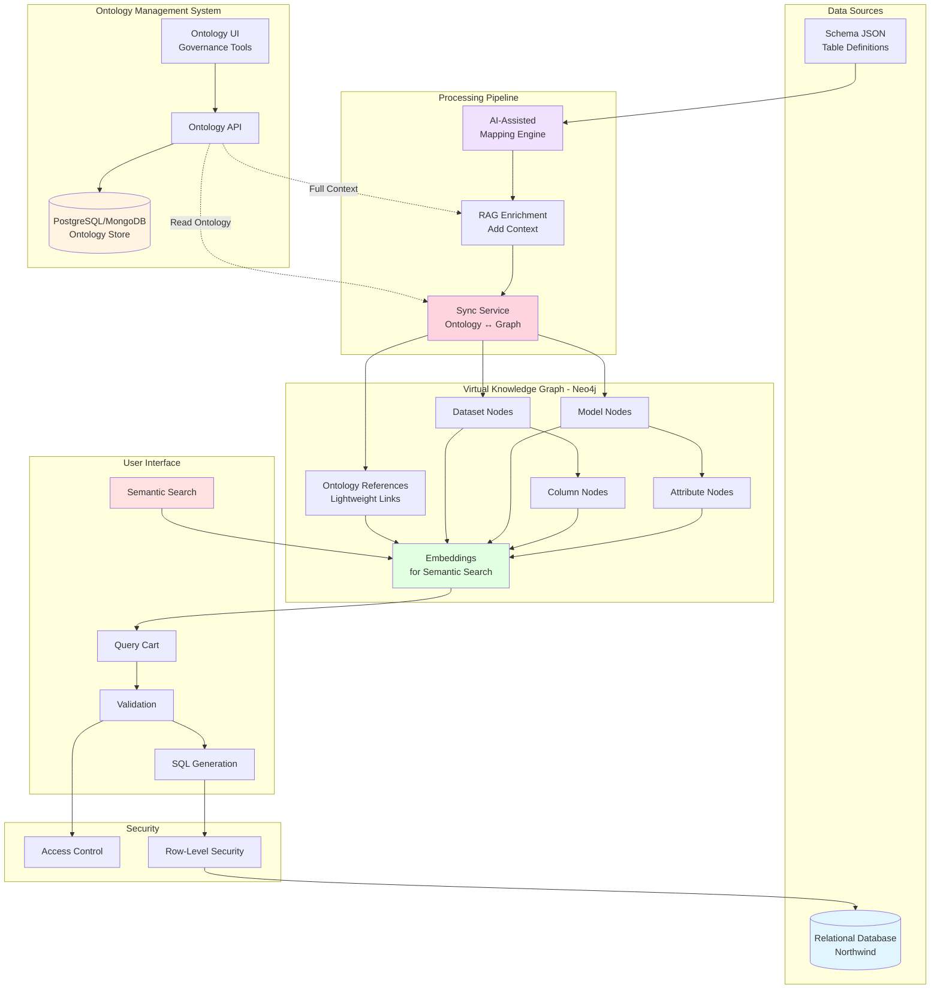
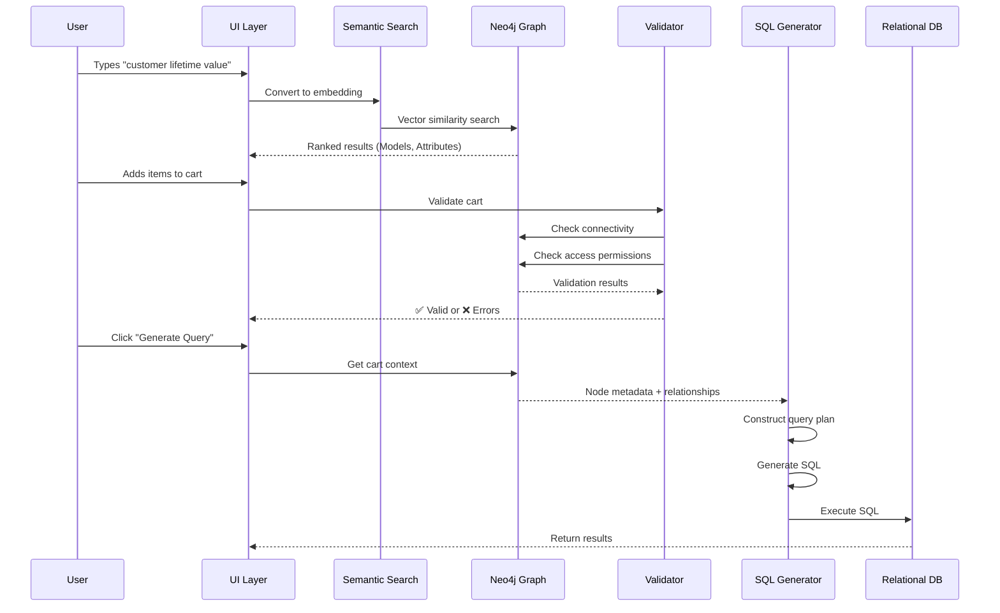
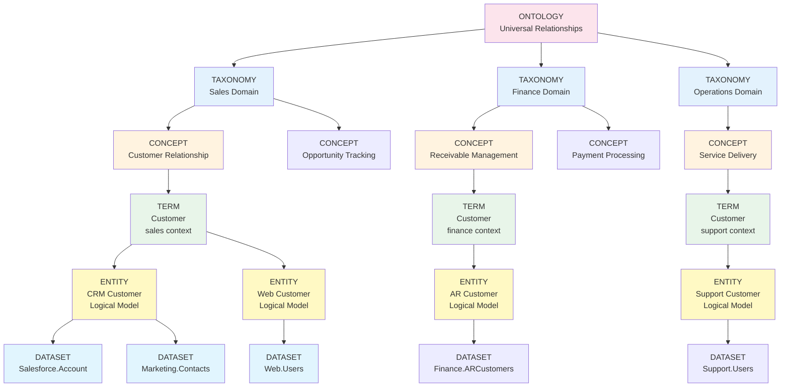
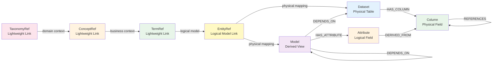
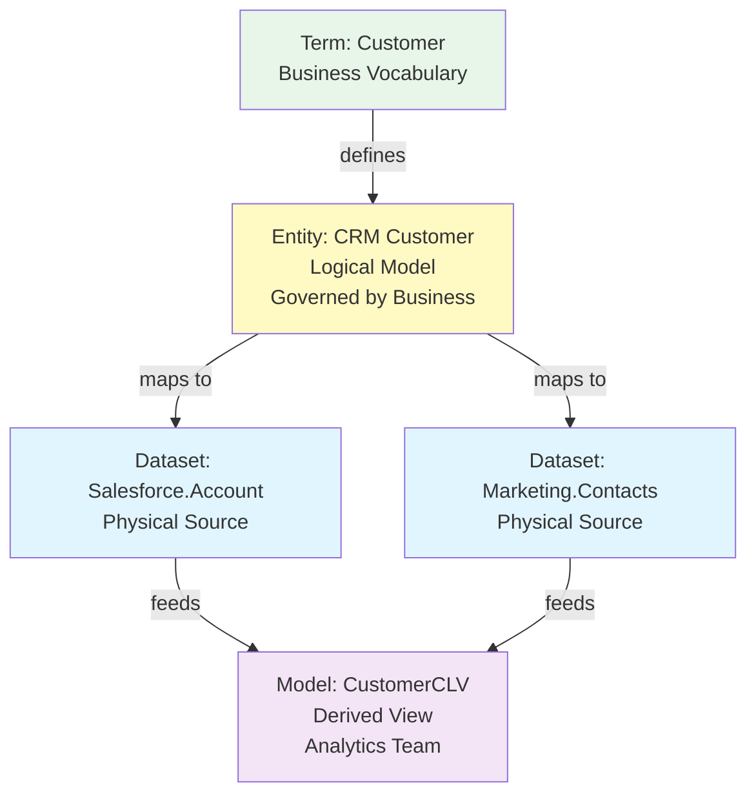
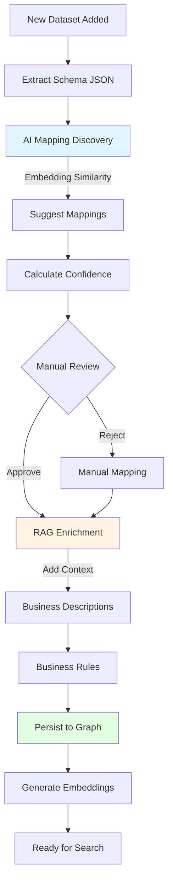
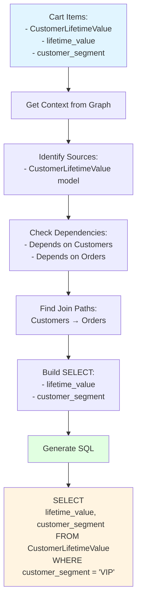
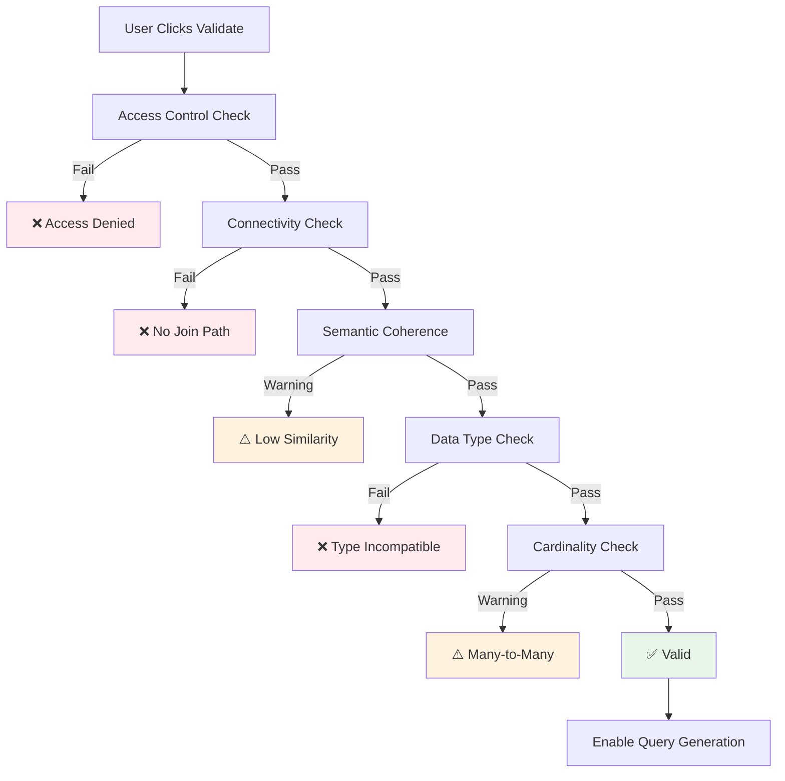
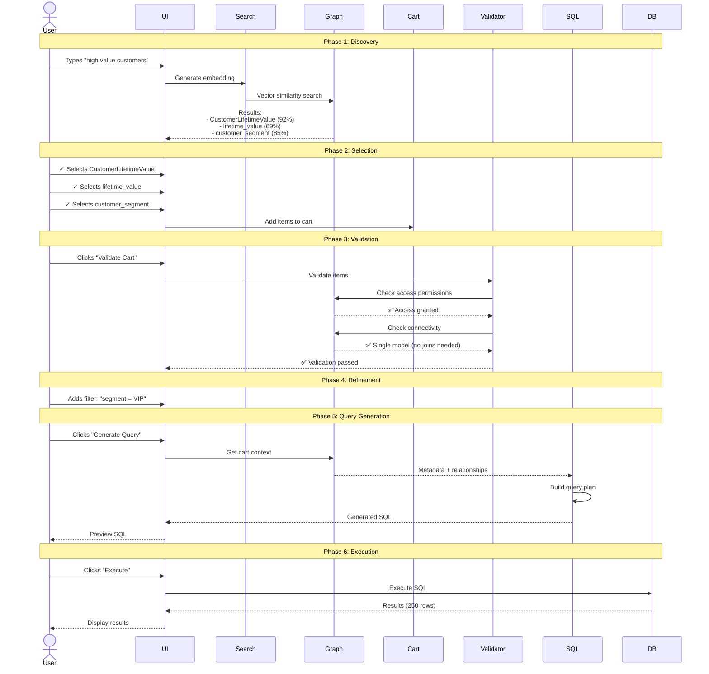

# Virtual Knowledge Graph Architecture
## Semantic Discovery & Natural Language Query System

---

## Table of Contents

1. [Executive Summary](#executive-summary)
2. [System Architecture](#system-architecture)
3. [Core Components](#core-components)
4. [Data Model](#data-model)
5. [Ontology Management](#ontology-management)
6. [Mapping & Enrichment Pipeline](#mapping--enrichment-pipeline)
7. [Graph Population](#graph-population)
8. [Semantic Discovery System](#semantic-discovery-system)
9. [Query Construction](#query-construction)
10. [Validation & Access Control](#validation--access-control)
11. [Complete User Journey](#complete-user-journey)
12. [Key Design Decisions](#key-design-decisions)
13. [Integration with Data Catalog](#integration-with-data-catalog)
14. [Benefits & Use Cases](#benefits--use-cases)
15. [Future Enhancements](#future-enhancements)

---

## Executive Summary

### The Problem

Business users struggle to query relational databases because:
- They don't know SQL
- They don't understand table schemas or join relationships
- Data is scattered across multiple tables and systems
- Column names are cryptic (e.g., `CUST_ID`, `ORD_DT`)

### The Solution

A **Virtual Knowledge Graph (VKG)** system that:
1. **Captures business semantics** through ontologies
2. **Maps technical schemas** to business concepts
3. **Enables semantic search** to discover relevant data
4. **Constructs SQL automatically** from user selections
5. **Validates queries** before execution
6. **Enforces access control** at dataset/column level

### Key Innovation

The graph stores **only metadata** (structure, relationships, semantics), not actual data. Real data stays in the relational database. The graph acts as a **semantic index** that translates natural language queries into SQL.

---

## System Architecture



### System Flow



---

## Core Components

### 1. Ontology Management System
- **Technology**: PostgreSQL or MongoDB (separate from graph)
- **Purpose**: Central repository for business ontologies with governance
- **Contains**: 
  - **Taxonomies**: Domain organization (Sales, Finance, Operations)
  - **Concepts**: Business areas within domains (Customer Relationship, Receivable Management)
  - **Terms**: Vocabulary with definitions, synonyms, and usage context
  - **Entities**: Logical data models that abstract physical tables (CRM Customer, AR Customer)
  - **Entity Mappings**: Links between logical entities and physical datasets
  - **Approval Workflows**: Status tracking, version history, data stewardship
- **Access**: Governance teams manage via dedicated UI and standard SQL tools
- **Key Benefit**: Ontology and entities can be managed independently without affecting the knowledge graph

### 2. Metadata Layer
- **Purpose**: Describe actual database structure
- **Format**: JSON Schema
- **Contains**: Tables, columns, data types, foreign keys

### 3. Mapping Engine
- **Purpose**: Connect ontology concepts to database elements
- **Method**: AI-assisted with manual override
- **Output**: Mapping configuration linking datasets to ontology terms (by reference ID)

### 4. Sync Service
- **Purpose**: Keep ontology references synchronized between systems
- **Method**: Watches ontology changes, updates lightweight references in Neo4j
- **Triggers**: Regenerates embeddings when ontology definitions change

### 5. Virtual Knowledge Graph
- **Technology**: Neo4j
- **Purpose**: Semantic index over relational data with lightweight ontology links
- **Contains**: 
  - Lightweight ontology references (TaxonomyRef, ConceptRef, TermRef, EntityRef with IDs + cached names)
  - Dataset/Model/Column/Attribute metadata
  - Mappings (entity_id/term_id → physical tables)
  - Relationship edges (REFERENCES for FKs, DEPENDS_ON for models, PHYSICALLY_STORED_IN for entity mappings)
  - Embeddings for semantic search
- **Does NOT Contain**: Full ontology definitions or actual business data (stored in separate systems)

### 6. Semantic Search
- **Technology**: Vector embeddings (Sentence Transformers / OpenAI)
- **Purpose**: Find relevant data by meaning using domain-aware context
- **Searches**: Dataset names, column descriptions, enriched with full ontology hierarchy

### 7. Query Constructor
- **Purpose**: Build SQL from selected graph nodes
- **Method**: Graph traversal to find join paths via foreign key relationships
- **Output**: Optimized, validated SQL query

### 8. Validators
- **Connectivity Validator**: Ensures selected items are joinable via FK relationships
- **Access Control Validator**: Enforces user permissions at dataset/column level
- **Semantic Coherence Validator**: Warns about semantically unrelated items

---

## Data Model

### Ontology Hierarchy (Stored in PostgreSQL/MongoDB)



**Key Concepts:**
- **TAXONOMY**: Domain-level organization (WHERE - Sales, Finance, Operations)
- **CONCEPT**: Business areas within domains (WHAT - Customer Relationship, Receivable Management)
- **TERM**: Vocabulary with context-specific definitions (Customer in sales ≠ Customer in finance)
- **ENTITY**: Logical data models that abstract physical implementation (CRM Customer, AR Customer)
- **DATASET**: Physical tables/sources in actual databases

**Entity Layer Benefits:**
- **Data Virtualization**: One logical entity maps to multiple physical sources
- **Abstraction**: Business users work with "CRM Customer" entity, not "Salesforce Account table"
- **Multi-Source Integration**: Single entity can aggregate data from multiple systems
- **Canonical Modeling**: Single source of truth for what a business concept means logically

### Graph Node Types (Stored in Neo4j)



### Node Structures (Key Properties Only)

```javascript
// Ontology Store (PostgreSQL/MongoDB)
Taxonomy {
    id: "uuid",
    name: "Sales Domain",
    description: "Sales and customer relationship management",
    owner: "Chief Revenue Officer",
    governance_body: "Sales Data Council",
    status: "approved"
}

Concept {
    id: "uuid",
    taxonomy_id: "uuid-ref",
    label: "Customer Relationship",
    business_area: "Revenue Generation",
    steward: "VP of Sales",
    status: "approved"
}

Term {
    id: "uuid",
    concept_id: "uuid-ref",
    preferred_term: "Customer",
    definition: "Individual or organization that purchases products or services",
    synonyms: ["Client", "Buyer", "Purchaser"],
    usage_context: "Used in sales, marketing, and CRM contexts",
    governance_status: "approved"
}

Entity {
    id: "uuid",
    term_id: "uuid-ref",
    logical_name: "CRM Customer",
    description: "Canonical customer entity from sales CRM systems",
    logical_properties: [
        {
            name: "customerId",
            dataType: "string",
            description: "Unique customer identifier",
            required: true
        },
        {
            name: "companyName",
            dataType: "string",
            description: "Legal company name"
        },
        {
            name: "lifetimeValue",
            dataType: "decimal",
            description: "Calculated customer lifetime value",
            derived: true
        }
    ],
    business_rules: ["customerId must be unique", "companyName required for B2B"],
    steward: "VP of Sales"
}

EntityMapping {
    entity_id: "uuid-of-entity",
    dataset_id: "uuid-of-dataset",
    mapping_type: "primary",  // primary, supplementary, archive
    column_mappings: [
        {
            logical_property: "customerId",
            physical_column: "AccountId",
            transformation: "direct"
        }
    ]
}

// Neo4j Graph (Lightweight References)
TaxonomyRef {
    ontology_id: "uuid-from-postgres",
    name: "Sales Domain",
    embedding: [0.123, -0.456, ...]
}

TermRef {
    ontology_id: "uuid-from-postgres",
    preferred_term: "Customer",
    concept_id: "uuid-ref",
    definition_summary: "Individual or org...",
    embedding: [0.234, -0.567, ...]
}

EntityRef {
    ontology_id: "uuid-from-postgres",
    logical_name: "CRM Customer",
    term_id: "uuid-ref",
    description: "Canonical customer entity...",
    entity_type: "logical_model",
    embedding: [0.345, -0.678, ...]
}

Dataset {
    name: "Customers",
    type: "table",
    database: "northwind",
    mapped_to_entity: "uuid-from-postgres",  // Link to entity
    description: "Customer master data",
    tags: ["customer", "master data"],
    embedding: [0.456, -0.789, ...]
}

Model {
    name: "CustomerLifetimeValue",
    type: "view",
    description: "Calculated CLV metrics and segments",
    depends_on_entities: ["uuid-entity-1", "uuid-entity-2"],
    refreshSchedule: "daily",
    embedding: [0.567, -0.890, ...]
}

Column {
    name: "CustomerID",
    dataType: "varchar(5)",
    isPrimaryKey: true,
    mapped_to_property: "uuid-from-postgres",  // Link to entity property
    description: "Unique customer identifier",
    embedding: [0.678, -0.901, ...]
}

// Relationship Properties (FK)
REFERENCES {
    constraintName: "FK_Orders_Customers",
    joinCondition: "Customers.CustomerID = Orders.CustomerID",
    cardinality: "one-to-many"
}
```

### Entity vs Model Distinction

**Entities (Ontology Layer):**
- **Logical** data models governed by business
- Stable over time, change through governance process
- Multiple physical mappings (one entity → many datasets)
- Business-defined properties and rules
- Example: "Customer", "Product", "Order"

**Models (Virtual KG Layer):**
- **Derived/computed** views created by data engineers
- May change frequently based on analytics needs
- Single transformation logic
- Analytics-focused with aggregations and calculations
- Example: "CustomerLifetimeValue", "MonthlySalesMetrics", "ProductRecommendations"



---

## Ontology Management

### Ontology Storage Architecture

**Separate System Approach:** Ontology definitions are stored in PostgreSQL/MongoDB, separate from the Neo4j knowledge graph. This enables:
- Independent governance workflows
- Standard SQL/NoSQL tooling for ontology management
- Easy version control and audit trails
- Integration with enterprise data catalogs
- Neo4j stays lightweight with only reference links

### Complete Ontology Structure (Multi-Domain)

```json
{
  "@context": {
    "@vocab": "http://enterprise.com/ontology#"
  },
  "ontology": {
    "name": "Enterprise Business Ontology",
    "version": "1.0",
    "domains": ["Sales", "Finance", "Operations", "HR"]
  },
  
  "taxonomies": [
    {
      "id": "sales_taxonomy",
      "name": "Sales Domain",
      "description": "Sales and customer relationship management",
      "owner": "Chief Revenue Officer",
      "governance_body": "Sales Data Council"
    },
    {
      "id": "finance_taxonomy",
      "name": "Finance Domain", 
      "description": "Financial operations and accounting",
      "owner": "Chief Financial Officer",
      "governance_body": "Finance Data Council"
    }
  ],
  
  "concepts": [
    {
      "id": "customer_relationship",
      "label": "Customer Relationship",
      "taxonomy": "sales_taxonomy",
      "description": "Entities and processes related to customer interactions",
      "business_area": "Revenue Generation",
      "steward": "VP of Sales",
      "related_concepts": ["prospect_management", "opportunity_tracking"]
    },
    {
      "id": "receivable_management",
      "label": "Receivable Management",
      "taxonomy": "finance_taxonomy",
      "description": "Entities that owe money to the organization",
      "business_area": "Accounts Receivable",
      "steward": "Controller"
    }
  ],
  
  "terms": [
    {
      "id": "customer_sales",
      "preferred_term": "Customer",
      "concept": "customer_relationship",
      "definition": "Individual or organization that purchases products or services",
      "synonyms": ["Client", "Buyer", "Purchaser"],
      "usage_context": "Used in sales, marketing, and CRM contexts",
      "examples": ["ALFKI - Alfreds Futterkiste"],
      "governance_status": "approved",
      "last_reviewed": "2024-01-15"
    },
    {
      "id": "customer_finance",
      "preferred_term": "Customer",
      "concept": "receivable_management",
      "definition": "Entity with an accounts receivable balance",
      "synonyms": ["Account", "Debtor"],
      "usage_context": "Used in finance, accounting, and collections",
      "governance_status": "approved"
    }
  ],
  
  "entities": [
    {
      "id": "crm_customer",
      "term": "customer_sales",
      "logical_name": "CRM Customer",
      "description": "Canonical customer entity from sales CRM systems",
      "entity_type": "logical_model",
      "logical_properties": [
        {
          "name": "customerId",
          "dataType": "string",
          "description": "Unique customer identifier",
          "required": true
        },
        {
          "name": "companyName",
          "dataType": "string",
          "description": "Legal company name",
          "required": true
        },
        {
          "name": "contactInfo",
          "dataType": "object",
          "description": "Contact details including phone and email"
        },
        {
          "name": "lifetimeValue",
          "dataType": "decimal",
          "description": "Calculated customer lifetime value",
          "derived": true,
          "derivation": "SUM(order.total) over customer lifetime"
        }
      ],
      "business_rules": [
        "customerId must be unique across all sources",
        "companyName required for B2B customers",
        "lifetimeValue updated monthly"
      ],
      "quality_threshold": 0.95,
      "steward": "VP of Sales"
    },
    {
      "id": "web_customer",
      "term": "customer_sales",
      "logical_name": "Web Customer",
      "description": "Customer entity from web registration and e-commerce",
      "entity_type": "logical_model",
      "logical_properties": [
        {
          "name": "customerId",
          "dataType": "string",
          "required": true
        },
        {
          "name": "email",
          "dataType": "string",
          "required": true
        },
        {
          "name": "registrationDate",
          "dataType": "date",
          "required": true
        }
      ],
      "business_rules": ["Email must be verified"],
      "steward": "VP of Digital"
    },
    {
      "id": "ar_customer",
      "term": "customer_finance",
      "logical_name": "AR Customer",
      "description": "Accounts receivable customer entity",
      "entity_type": "logical_model",
      "logical_properties": [
        {
          "name": "accountNumber",
          "dataType": "string",
          "required": true
        },
        {
          "name": "creditLimit",
          "dataType": "decimal",
          "required": true
        },
        {
          "name": "outstandingBalance",
          "dataType": "decimal",
          "derived": true
        }
      ],
      "business_rules": ["Credit limit must not be exceeded"],
      "steward": "Controller"
    }
  ],
  
  "entity_mappings": [
    {
      "entity_id": "crm_customer",
      "physical_mappings": [
        {
          "dataset": "Salesforce.Account",
          "database": "salesforce",
          "table": "Account",
          "mapping_type": "primary",
          "column_mappings": [
            {
              "logical_property": "customerId",
              "physical_column": "AccountId",
              "transformation": "direct"
            },
            {
              "logical_property": "companyName",
              "physical_column": "Name",
              "transformation": "direct"
            }
          ]
        },
        {
          "dataset": "Marketing.Contacts",
          "database": "marketing_db",
          "table": "contacts",
          "mapping_type": "supplementary",
          "column_mappings": [
            {
              "logical_property": "customerId",
              "physical_column": "salesforce_id",
              "transformation": "direct"
            },
            {
              "logical_property": "contactInfo.email",
              "physical_column": "email_address",
              "transformation": "direct"
            }
          ]
        }
      ]
    },
    {
      "entity_id": "web_customer",
      "physical_mappings": [
        {
          "dataset": "Web.Users",
          "database": "web_db",
          "table": "users",
          "mapping_type": "primary",
          "column_mappings": [
            {
              "logical_property": "customerId",
              "physical_column": "user_id",
              "transformation": "direct"
            },
            {
              "logical_property": "email",
              "physical_column": "email",
              "transformation": "lowercase"
            }
          ]
        }
      ]
    }
  ]
}
```

### Ontology Database Schema (PostgreSQL Example)

```sql
-- Core Tables (existing)
CREATE TABLE taxonomies (
    id UUID PRIMARY KEY,
    name VARCHAR(255),
    description TEXT,
    owner VARCHAR(255),
    status VARCHAR(50),
    created_at TIMESTAMP,
    updated_at TIMESTAMP
);

CREATE TABLE concepts (
    id UUID PRIMARY KEY,
    taxonomy_id UUID REFERENCES taxonomies(id),
    label VARCHAR(255),
    description TEXT,
    business_area VARCHAR(255),
    steward VARCHAR(255),
    status VARCHAR(50)
);

CREATE TABLE terms (
    id UUID PRIMARY KEY,
    concept_id UUID REFERENCES concepts(id),
    preferred_term VARCHAR(255),
    definition TEXT,
    usage_context TEXT,
    synonyms TEXT[],
    governance_status VARCHAR(50),
    last_reviewed DATE
);

-- Entity Tables (NEW)
CREATE TABLE entities (
    id UUID PRIMARY KEY,
    term_id UUID REFERENCES terms(id),
    logical_name VARCHAR(255) NOT NULL,
    description TEXT,
    entity_type VARCHAR(50),  -- logical_model, aggregate, composite
    business_rules TEXT[],
    quality_threshold DECIMAL,
    steward VARCHAR(255),
    status VARCHAR(50),
    created_at TIMESTAMP,
    updated_at TIMESTAMP
);

CREATE TABLE entity_properties (
    id UUID PRIMARY KEY,
    entity_id UUID REFERENCES entities(id),
    name VARCHAR(255) NOT NULL,
    data_type VARCHAR(50),
    description TEXT,
    required BOOLEAN DEFAULT false,
    derived BOOLEAN DEFAULT false,
    derivation_logic TEXT,
    validation_rules TEXT[]
);

CREATE TABLE entity_mappings (
    id UUID PRIMARY KEY,
    entity_id UUID REFERENCES entities(id),
    dataset_name VARCHAR(255),
    database_name VARCHAR(255),
    table_name VARCHAR(255),
    mapping_type VARCHAR(50),  -- primary, supplementary, archive
    created_at TIMESTAMP
);

CREATE TABLE entity_property_mappings (
    id UUID PRIMARY KEY,
    entity_mapping_id UUID REFERENCES entity_mappings(id),
    entity_property_id UUID REFERENCES entity_properties(id),
    physical_column VARCHAR(255),
    transformation VARCHAR(50),  -- direct, lowercase, concatenate, etc.
    transformation_logic TEXT
);

-- Governance Tables (existing)
CREATE TABLE term_approvals (
    id UUID PRIMARY KEY,
    term_id UUID REFERENCES terms(id),
    submitted_by VARCHAR(255),
    reviewed_by VARCHAR(255),
    status VARCHAR(50),
    comments TEXT
);

CREATE TABLE term_versions (
    id UUID PRIMARY KEY,
    term_id UUID REFERENCES terms(id),
    version VARCHAR(50),
    definition TEXT,
    changed_by VARCHAR(255),
    changed_at TIMESTAMP
);
```

### Sync Process

**Ontology → Neo4j Synchronization:**
When ontology definitions change in PostgreSQL/MongoDB, a sync service:
1. Detects changes via database triggers or polling
2. Fetches full ontology context (taxonomy → concept → term → entity)
3. Generates rich embeddings using complete hierarchical context including entity definitions
4. Updates lightweight references in Neo4j (TaxonomyRef, ConceptRef, TermRef, EntityRef)
5. Updates dataset mappings (Dataset → EntityRef relationships)
6. Invalidates cached embeddings that depend on changed definitions

---

## Mapping & Enrichment Pipeline

### Pipeline Flow



### AI-Assisted Mapping

**Discover Mappings:** Generate embeddings for both database tables and ontology terms, then calculate semantic similarity. Propose mappings where similarity exceeds threshold (e.g., 0.7), ranked by confidence score.

**Enrich Mappings:** Use RAG and LLM to add business context, common use cases, data quality rules, and related concepts for each discovered mapping. This enrichment feeds into embedding generation for better semantic search.

### Mapping Configuration Output

```json
{
  "mapping_id": "map_001",
  "source_table": "Customers",
  "ontology_term_id": "uuid-from-ontology-store",
  "confidence": 0.98,
  "status": "confirmed",
  "enrichment": {
    "business_context": "Primary source for customer relationship management",
    "use_cases": ["Customer segmentation", "Sales analysis"],
    "quality_rules": ["CustomerID must be unique", "CompanyName required"]
  },
  "column_mappings": [
    {
      "column": "CustomerID",
      "ontology_property_id": "uuid-from-ontology-store",
      "confidence": 1.0,
      "transformation": "direct"
    },
    {
      "column": "CompanyName",
      "ontology_property_id": "uuid-from-ontology-store",
      "confidence": 0.99,
      "transformation": "direct"
    }
  ]
}
```

---

## Graph Population

### Creating Virtual Graph Metadata

**Populate Dataset:** Create dataset node with metadata and business context from enrichment. For each column, create column node and link to dataset via HAS_COLUMN relationship. If column is a foreign key, create REFERENCES relationship to target column with join metadata (constraint name, join condition, cardinality).

**Create Entity References:** For each entity in ontology store, create lightweight EntityRef node in Neo4j with cached name and description. Link entity to its parent term via REPRESENTED_BY_ENTITY relationship. For each physical mapping, link entity to dataset via PHYSICALLY_STORED_IN relationship with mapping type (primary, supplementary, archive).

**Create Ontology Mappings:** Link dataset to entity (by UUID reference to ontology store). Map each column to corresponding entity property (also by UUID reference). Store confidence scores, transformation logic, and mapping metadata for traceability.

### Example: Northwind Graph with Entity Layer

```cypher
// ========================================
// Ontology Hierarchy References
// ========================================

// Taxonomy
CREATE (tax_sales:TaxonomyRef {
  ontology_id: "tax-sales-uuid",
  name: "Sales Domain",
  embedding: [...]
})

// Concept
CREATE (con_custrel:ConceptRef {
  ontology_id: "con-custrel-uuid",
  name: "Customer Relationship",
  taxonomy_id: "tax-sales-uuid",
  embedding: [...]
})

// Term
CREATE (term_cust:TermRef {
  ontology_id: "term-cust-sales-uuid",
  preferred_term: "Customer",
  concept_id: "con-custrel-uuid",
  definition_summary: "Individual or org that purchases...",
  embedding: [...]
})

// ========================================
// Entity Layer (NEW - Logical Models)
// ========================================

// CRM Customer Entity (logical model)
CREATE (ent_crm:EntityRef {
  ontology_id: "ent-crm-cust-uuid",
  logical_name: "CRM Customer",
  term_id: "term-cust-sales-uuid",
  description: "Canonical customer entity from sales CRM",
  entity_type: "logical_model",
  properties: ["customerId", "companyName", "contactInfo", "lifetimeValue"],
  embedding: [...]
})

// Web Customer Entity (logical model)
CREATE (ent_web:EntityRef {
  ontology_id: "ent-web-cust-uuid",
  logical_name: "Web Customer",
  term_id: "term-cust-sales-uuid",
  description: "Customer from web registration",
  entity_type: "logical_model",
  properties: ["customerId", "email", "registrationDate"],
  embedding: [...]
})

// ========================================
// Physical Datasets
// ========================================

// Salesforce Dataset (primary source for CRM Customer)
CREATE (ds_sf:Dataset {
  name: "Salesforce.Account",
  database: "salesforce",
  table: "Account",
  sourceSystem: "Salesforce",
  mapped_to_entity: "ent-crm-cust-uuid",
  mapping_type: "primary",
  tags: ["CRM", "sales"]
})

// Marketing Dataset (supplementary source for CRM Customer)
CREATE (ds_mktg:Dataset {
  name: "Marketing.Contacts",
  database: "marketing_db",
  table: "contacts",
  sourceSystem: "Marketing DB",
  mapped_to_entity: "ent-crm-cust-uuid",
  mapping_type: "supplementary",
  tags: ["marketing", "contacts"]
})

// Web Dataset (primary source for Web Customer)
CREATE (ds_web:Dataset {
  name: "Web.Users",
  database: "web_db",
  table: "users",
  sourceSystem: "Web Application",
  mapped_to_entity: "ent-web-cust-uuid",
  mapping_type: "primary",
  tags: ["web", "registration"]
})

// ========================================
// Columns
// ========================================

// Salesforce Columns
CREATE (col_sf_id:Column {
  name: "AccountId",
  dataType: "varchar(18)",
  isPrimaryKey: true,
  mapped_to_property: "uuid-customerId-property"
})

CREATE (col_sf_name:Column {
  name: "Name",
  dataType: "varchar(255)",
  mapped_to_property: "uuid-companyName-property"
})

// Marketing Columns
CREATE (col_mktg_sfid:Column {
  name: "salesforce_id",
  dataType: "varchar(18)",
  mapped_to_property: "uuid-customerId-property"
})

CREATE (col_mktg_email:Column {
  name: "email_address",
  dataType: "varchar(255)",
  mapped_to_property: "uuid-email-property"
})

// Web Columns
CREATE (col_web_id:Column {
  name: "user_id",
  dataType: "int",
  isPrimaryKey: true,
  mapped_to_property: "uuid-customerId-property"
})

CREATE (col_web_email:Column {
  name: "email",
  dataType: "varchar(255)",
  mapped_to_property: "uuid-email-property"
})

// ========================================
// Relationships - Ontology Hierarchy
// ========================================

CREATE (tax_sales)-[:CONTAINS_CONCEPT]->(con_custrel)
CREATE (con_custrel)-[:DEFINED_BY_TERM]->(term_cust)
CREATE (term_cust)-[:REPRESENTED_BY_ENTITY]->(ent_crm)
CREATE (term_cust)-[:REPRESENTED_BY_ENTITY]->(ent_web)

// ========================================
// Relationships - Entity to Datasets (Physical Mappings)
// ========================================

// CRM Customer Entity maps to TWO physical datasets
CREATE (ent_crm)-[:PHYSICALLY_STORED_IN {
  mapping_type: "primary",
  confidence: 1.0
}]->(ds_sf)

CREATE (ent_crm)-[:PHYSICALLY_STORED_IN {
  mapping_type: "supplementary",
  confidence: 0.95
}]->(ds_mktg)

// Web Customer Entity maps to ONE physical dataset
CREATE (ent_web)-[:PHYSICALLY_STORED_IN {
  mapping_type: "primary",
  confidence: 1.0
}]->(ds_web)

// ========================================
// Relationships - Datasets to Columns
// ========================================

CREATE (ds_sf)-[:HAS_COLUMN]->(col_sf_id)
CREATE (ds_sf)-[:HAS_COLUMN]->(col_sf_name)

CREATE (ds_mktg)-[:HAS_COLUMN]->(col_mktg_sfid)
CREATE (ds_mktg)-[:HAS_COLUMN]->(col_mktg_email)

CREATE (ds_web)-[:HAS_COLUMN]->(col_web_id)
CREATE (ds_web)-[:HAS_COLUMN]->(col_web_email)

// ========================================
// Relationships - Foreign Keys
// ========================================

// Orders Dataset
CREATE (ds_orders:Dataset {
  name: "Orders",
  sourceSystem: "Northwind_DB"
})

CREATE (col_order_custid:Column {
  name: "CustomerID",
  dataType: "varchar(5)",
  mapped_to_property: "uuid-customerId-property"
})

CREATE (ds_orders)-[:HAS_COLUMN]->(col_order_custid)

// FK Relationship (cross-entity reference)
CREATE (col_order_custid)-[:REFERENCES {
  constraintName: "FK_Orders_Customers",
  joinCondition: "Orders.CustomerID = Customers.CustomerID",
  cardinality: "many-to-one"
}]->(col_sf_id)

// ========================================
// Models (Derived Views) - Analytics Layer
// ========================================

CREATE (mod_clv:Model {
  name: "CustomerLifetimeValue",
  type: "view",
  description: "Calculates CLV metrics from customer and order data",
  depends_on_entities: ["ent-crm-cust-uuid"],
  refreshSchedule: "daily",
  embedding: [...]
})

// Model depends on Entity (not direct dataset)
CREATE (mod_clv)-[:DEPENDS_ON_ENTITY]->(ent_crm)

// Model attributes
CREATE (attr_clv:Attribute {
  name: "lifetime_value",
  dataType: "decimal",
  description: "Total predicted customer value"
})

CREATE (attr_segment:Attribute {
  name: "customer_segment",
  dataType: "varchar",
  description: "Customer segment: VIP, Active, At Risk"
})

CREATE (mod_clv)-[:HAS_ATTRIBUTE]->(attr_clv)
CREATE (mod_clv)-[:HAS_ATTRIBUTE]->(attr_segment)
```

### Key Relationships Summary

**Ontology Hierarchy (Top-Down):**
```
Taxonomy -[:CONTAINS_CONCEPT]-> Concept
Concept -[:DEFINED_BY_TERM]-> Term
Term -[:REPRESENTED_BY_ENTITY]-> Entity (logical model)
Entity -[:PHYSICALLY_STORED_IN]-> Dataset (physical source)
Dataset -[:HAS_COLUMN]-> Column
```

**Analytics Layer:**
```
Model -[:DEPENDS_ON_ENTITY]-> Entity
Model -[:HAS_ATTRIBUTE]-> Attribute
Attribute -[:DERIVED_FROM]-> Column
```

**Physical Relationships:**
```
Column -[:REFERENCES]-> Column (foreign keys)
Model -[:DEPENDS_ON]-> Dataset (if accessing physical directly)
```

---

## Semantic Discovery System

### Embedding Generation with Entity Context

**Generate Node Embedding:** Combine multiple fields from node and its **complete ontology hierarchy including entity layer** to create rich semantic context. For a dataset node:

1. Traverse to EntityRef (logical model the dataset belongs to)
2. Traverse from Entity → Term → Concept → Taxonomy
3. Fetch full definitions from ontology store via reference IDs
4. Concatenate hierarchical context:
   - **Taxonomy**: Domain name, owner, governance body
   - **Concept**: Business area, concept description, steward
   - **Term**: Preferred term, definition, synonyms, usage context
   - **Entity**: Logical name, entity description, logical properties, business rules
   - **Dataset**: Physical name, database, table, description, columns
5. Encode this enriched text using transformer model to generate 384-dimensional embedding vector

**Embed All Nodes:** Query graph for all searchable nodes (Dataset, Model, Column, Attribute, EntityRef) without embeddings. For each node, traverse complete ontology hierarchy including entity layer, fetch full context from ontology store, generate embedding, and store in graph node.

### Example: Rich Entity-Aware Embedding

**Without Entity Layer:**
```
Context for "Salesforce.Account":
- Table: Salesforce.Account
- Description: Sales accounts
- Columns: AccountId, Name, Phone

Embedding: [0.23, -0.45, ...]
```

**With Entity Layer:**
```
Context for "Salesforce.Account":

Domain: Sales Domain
Governance: Sales Data Council
Owner: Chief Revenue Officer

Business Area: Revenue Generation
Concept: Customer Relationship
Description: Entities related to customer interactions
Steward: VP of Sales

Term: Customer (sales context)
Definition: Individual or organization that purchases products or services
Synonyms: Client, Buyer, Purchaser
Usage: Used in sales, marketing, and CRM contexts

Logical Entity: CRM Customer
Entity Type: Logical Model
Entity Description: Canonical customer entity from sales CRM systems
Logical Properties: customerId, companyName, contactInfo, lifetimeValue
Business Rules: customerId must be unique, companyName required for B2B
Mapping Type: Primary Source

Physical Dataset: Salesforce.Account
Database: Salesforce
Table: Account
Columns: AccountId, Name, Phone, BillingAddress
Tags: CRM, sales

Embedding: [0.31, -0.52, 0.71, ...]  ← Much richer semantic representation
```

### Semantic Search with Entity Awareness

**Search Process:** Generate embedding for user's query text. Search Neo4j graph for nodes (including EntityRef) with embeddings, calculate cosine similarity, filter by similarity threshold (>0.5), optionally filter by node type or domain tags, and return top-k results ordered by similarity score.

**Entity-Level Search:** Users can discover logical entities (CRM Customer, AR Customer) rather than just physical tables. When user selects an entity, system automatically knows all physical sources that comprise that entity.

**Domain-Aware Search:** Users can filter results by their preferred domain (e.g., "Sales" vs "Finance"). This disambiguates both terms AND entities - "CRM Customer" (sales) vs "AR Customer" (finance).

### Search Results Example with Entities

**User Query:** "customer information"

**Results:**
```json
[
  {
    "node_id": 123,
    "node_type": "EntityRef",
    "name": "CRM Customer",
    "description": "Canonical customer entity from sales CRM systems",
    "similarity": 0.94,
    "entity_type": "logical_model",
    "domain": "Sales Domain",
    "term": "Customer (sales context)",
    "physical_sources": ["Salesforce.Account", "Marketing.Contacts"],
    "properties": ["customerId", "companyName", "contactInfo", "lifetimeValue"]
  },
  {
    "node_id": 124,
    "node_type": "EntityRef",
    "name": "Web Customer",
    "description": "Customer from web registration",
    "similarity": 0.91,
    "entity_type": "logical_model",
    "domain": "Sales Domain",
    "term": "Customer (sales context)",
    "physical_sources": ["Web.Users"],
    "properties": ["customerId", "email", "registrationDate"]
  },
  {
    "node_id": 125,
    "node_type": "Dataset",
    "name": "Salesforce.Account",
    "description": "Sales accounts from Salesforce",
    "similarity": 0.89,
    "parent_entity": "CRM Customer",
    "mapping_type": "primary",
    "domain": "Sales Domain"
  },
  {
    "node_id": 456,
    "node_type": "Model",
    "name": "CustomerLifetimeValue",
    "description": "Calculates CLV metrics",
    "similarity": 0.87,
    "depends_on_entities": ["CRM Customer"],
    "domain": "Sales Domain"
  }
]
```

**User Benefits:**
1. **Logical First**: Top results are logical entities (CRM Customer, Web Customer)
2. **Multi-Source Awareness**: System shows which physical tables comprise each entity
3. **Domain Context**: Clear indication that these are "Sales" customers, not "Finance" customers
4. **Derived Views**: Models that depend on entities also appear in results

---

## Query Construction

### Query Cart System

**Cart Structure:** Maintains list of selected node IDs from search results. 

**Get Context:** Query graph to retrieve full metadata for cart items including parent datasets/models, dependency chains (via DEPENDS_ON relationships), and foreign key relationships (via REFERENCES edges with join conditions).

### SQL Generation

**Generate SQL:** Identify primary source table/model from cart items. Build SELECT clause from selected columns/attributes. Find shortest join paths between sources using graph traversal over REFERENCES relationships. Construct WHERE clause from user filters. Assemble complete SQL with proper JOIN syntax and conditions. Optionally validate and optimize using SQLGlot.

### Query Construction Flow



---

## Validation & Access Control

### Validation System



### Connectivity Validator

**Validate Connectivity:** Query graph to find parent datasets/models for all cart items. If single source, return INFO (no joins needed). For multiple sources, check each pair for existence of join path using shortest path algorithm over REFERENCES and DEPENDS_ON relationships. If any pair is disconnected, return ERROR with details. Otherwise return INFO (all items joinable).

**Check Join Path:** Use Cypher shortest path query to find connection between two sources via foreign key relationships (REFERENCES edges) or model dependencies (DEPENDS_ON edges). Return true if path exists.

### Access Control System

**Validate Access:** Fetch user's permissions from graph (roles and allowed resources via HAS_ROLE and HAS_POLICY relationships). For each cart item, check if user has access to parent resource. Check for column-level restrictions (e.g., PII fields require special permission). Return ERROR with denied items if any access violations found.

**Get User Permissions:** Query graph for user node, traverse to roles and policies, collect all resources user can access via GRANTS_ACCESS_TO relationships. Also collect any restricted resources via RESTRICTS_ACCESS_TO relationships.

### Access Control Graph Structure

```cypher
// User and Role
CREATE (user:User {
  userId: "john.doe@company.com",
  name: "John Doe",
  department: "Sales"
})

CREATE (role:Role {
  roleId: "sales_analyst",
  name: "Sales Analyst"
})

CREATE (user)-[:HAS_ROLE]->(role)

// Access Policy
CREATE (policy:AccessPolicy {
  policyId: "policy_001",
  resourceType: "Dataset",
  action: "READ",
  effect: "ALLOW"
})

CREATE (role)-[:HAS_POLICY]->(policy)
CREATE (policy)-[:GRANTS_ACCESS_TO]->(ds:Dataset {name: "Customers"})

// PII Restriction
CREATE (pii_policy:AccessPolicy {
  policyId: "policy_002",
  resourceType: "Column",
  action: "READ",
  effect: "DENY",
  reason: "Contains PII"
})

CREATE (pii_policy)-[:RESTRICTS_ACCESS_TO]->(col:Column {name: "SSN"})
```

---

## Complete User Journey

### End-to-End Flow



### Example Session

**Step 1: User Search**
```
User: "show me high value customers"

Search Results:
✓ Model: CustomerLifetimeValue (92% match)
  "Calculates customer lifetime value metrics"
  
✓ Attribute: lifetime_value (89% match)
  "Total predicted customer value"
  
✓ Attribute: customer_segment (85% match)
  "Calculated segment: VIP, Active, At Risk"
```

**Step 2: Cart Selection**
```
Cart (3 items):
├─ CustomerLifetimeValue (Model)
├─ lifetime_value (Attribute)
└─ customer_segment (Attribute)
```

**Step 3: Validation**
```
Validating cart...

✅ Access Control: Passed
   - User has access to CustomerLifetimeValue model
   
✅ Connectivity: Passed
   - All attributes from same model (no joins needed)
   
✅ Data Types: Passed
   - All fields compatible
   
⚠️  Note: customer_segment is categorical (values: VIP, Active, At Risk)
```

**Step 4: Query Generation**
```
Graph Analysis:
├─ Source: CustomerLifetimeValue (Model)
├─ Dependencies: Customers, Orders (auto-handled by model)
├─ Attributes: 2 selected
└─ Joins: None needed (single model)

Generated SQL:
┌────────────────────────────────────────────┐
│ SELECT                                     │
│   customer_id,                             │
│   lifetime_value,                          │
│   customer_segment                         │
│ FROM CustomerLifetimeValue                 │
│ WHERE customer_segment = 'VIP'             │
│ ORDER BY lifetime_value DESC               │
└────────────────────────────────────────────┘
```

**Step 5: Execution**
```
Executing query...

Results: 47 rows returned

┌─────────────┬────────────────┬──────────────────┐
│ customer_id │ lifetime_value │ customer_segment │
├─────────────┼────────────────┼──────────────────┤
│ QUICK       │ $15,420.00     │ VIP              │
│ SAVEA       │ $14,850.50     │ VIP              │
│ ERNSH       │ $12,340.75     │ VIP              │
│ ...         │ ...            │ ...              │
└─────────────┴────────────────┴──────────────────┘
```

---

## Key Design Decisions

### 1. Separation of Concerns

**Ontology Storage:** PostgreSQL/MongoDB separate from Neo4j
- **Rationale**: Enables independent governance workflows, standard SQL tooling, easy version control
- **Benefit**: Governance teams manage ontology without touching knowledge graph
- **Trade-off**: Requires sync service to keep systems aligned

**Graph Storage:** Lightweight ontology references only
- **Rationale**: Neo4j optimized for relationship traversal, not full ontology management  
- **Benefit**: Graph stays fast and focused on metadata and search
- **Trade-off**: Must fetch full ontology details from separate system when needed

### 2. Entity Layer as Logical Abstraction

**Entity Between Term and Dataset:** Term → Entity → Dataset hierarchy
- **Rationale**: Logical data models abstract physical implementation complexity
- **Benefit**: 
  - One logical entity maps to multiple physical sources (data virtualization)
  - Business users work with "CRM Customer" not "Salesforce Account table"
  - Single source of truth for business definitions
  - Enables multi-source data integration at logical level
- **Trade-off**: Additional layer to maintain, but essential for enterprise scale

**Entity vs Model Distinction:**
- **Entities**: Governed logical models (stable, business-defined, multiple physical mappings)
- **Models**: Analytics views (dynamic, engineer-defined, single transformation)
- **Rationale**: Clear separation between governed business definitions and analytics derivatives
- **Benefit**: Governance focused on stable entities, analytics team free to iterate on models

### 3. Multi-Domain Architecture

**Hierarchical Ontology:** Taxonomy → Concept → Term → Entity → Dataset
- **Rationale**: Same term ("Customer") has different meanings across domains, and different logical models
- **Benefit**: Domain-aware search provides accurate, contextual results with logical abstractions
- **Trade-off**: More complex structure requires careful governance

**Embeddings with Full Context:** Include complete hierarchy in embedding generation
- **Rationale**: Richer context including entity definitions improves semantic search accuracy
- **Benefit**: Better disambiguation, relevance ranking, and logical-physical mapping
- **Trade-off**: Embeddings must be regenerated when ontology or entity definitions change

### 4. Virtual Knowledge Graph Pattern

**Metadata Only:** Graph stores structure, not actual data
- **Rationale**: Data volume would overwhelm graph, relational DB optimized for data storage
- **Benefit**: Single source of truth for data, graph remains lightweight
- **Trade-off**: Must execute generated SQL on source database

**Foreign Keys as Edges:** Store FK relationships as graph edges, not properties
- **Rationale**: Graph databases excel at relationship traversal
- **Benefit**: Fast join path discovery, natural graph semantics, cross-entity joins
- **Trade-off**: More relationship types to manage

### 5. SQL Validation & Optimization

**SQLGlot Integration:** Parse, validate, optimize before execution
- **Rationale**: Catch errors early, improve query performance, support multiple dialects
- **Benefit**: Transpile between SQL dialects, apply optimization patterns
- **Trade-off**: Additional processing step before execution

---

## Technology Stack

### Core Systems

**Ontology Management:**
- PostgreSQL or MongoDB for ontology storage
- Custom UI or existing data catalog tool for governance
- REST/GraphQL API for ontology access

**Virtual Knowledge Graph:**
- Neo4j 5.x for metadata and relationship management
- Vector indexes for semantic search (cosine similarity)
- Graph algorithms for path finding and connectivity

**AI/ML:**
- Sentence Transformers or OpenAI for embeddings
- LangChain for LLM orchestration and RAG
- Vector similarity search (Neo4j native or external)

**SQL Processing:**
- SQLGlot for parsing, validation, optimization, transpilation
- SQLAlchemy for database introspection
- Support for PostgreSQL, MySQL, SQL Server, Oracle

**Integration:**
- Sync service for ontology → graph synchronization
- REST APIs for frontend integration
- Message queue (Redis/Kafka) for async processing

### Deployment Options

**Cloud Native:**
- Neo4j Aura for managed graph database
- AWS RDS/Azure Database for ontology storage  
- Docker containers for services
- Kubernetes for orchestration

**On-Premise:**
- Neo4j Enterprise cluster
- PostgreSQL HA setup
- VM-based deployment

---

## Integration with Data Catalog

### Bi-Directional Sync

**Catalog → VKG:**
- Import taxonomies, concepts, and terms from catalog
- Sync data stewardship and governance metadata
- Pull data lineage information
- Import quality rules and business context

**VKG → Catalog:**
- Export usage patterns and query analytics
- Send semantic search insights
- Share user feedback on data quality
- Provide query examples for documentation

### Complementary Roles

**Data Catalog Handles:**
- Visual data lineage diagrams
- Glossary management UI
- Approval workflow interfaces
- Compliance reporting
- Data quality dashboards

**VKG Provides:**
- Natural language semantic search
- Automatic SQL generation
- Query cart and validation
- Context-aware recommendations
- Domain-specific disambiguation

---

## Benefits & Use Cases

### For Business Users
- ✅ **No SQL knowledge required** - Search and select data by meaning, not syntax
- ✅ **Logical entity abstraction** - Work with "CRM Customer" instead of "Salesforce.Account table"
- ✅ **Domain-aware discovery** - Find "Customer" in your specific context (Sales vs Finance)
- ✅ **Understand relationships** - See how entities and data connect visually through graph
- ✅ **Multi-source transparency** - Know which physical tables comprise a logical entity
- ✅ **Self-service analytics** - Build queries without IT support or data team bottlenecks
- ✅ **Validated queries** - System ensures query validity before execution

### For Data Engineers
- ✅ **Centralized metadata** - Single source of truth for data lineage and structure
- ✅ **Automated discovery** - AI-assisted mapping reduces manual cataloging work
- ✅ **Impact analysis** - Understand downstream effects of schema changes via graph
- ✅ **Multi-dialect support** - SQLGlot enables querying across database types
- ✅ **Audit trail** - Track who accessed what data and when

### For Data Governance
- ✅ **Separate ontology management** - Govern business terms independently from technical metadata
- ✅ **Approval workflows** - Standard SQL-based governance processes
- ✅ **PII protection** - Column-level access restrictions and policy enforcement
- ✅ **Data lineage** - Track data from source to consumption through graph relationships
- ✅ **Usage analytics** - Monitor which datasets are queried and by whom
- ✅ **Compliance** - Enforce data access policies at granular level
- ✅ **Quality tracking** - Flag stale, deprecated, or low-quality data

### Enterprise Use Cases

**Multi-Domain Organizations:**
- Sales, Finance, Operations teams query same data with different semantics
- "Customer" means different things in different contexts
- Each context has different logical entities (CRM Customer, AR Customer, Support Customer)
- Domain-specific search prevents confusion and incorrect queries

**Data Virtualization:**
- Single logical entity (CRM Customer) maps to multiple physical sources (Salesforce, Marketing DB, Web DB)
- Users select "CRM Customer" entity, system automatically joins relevant physical tables
- Abstracts complexity of multi-source integration
- Canonical business definitions independent of physical implementation

**Data Catalog Complement:**
- Enhance existing catalog (Alation, Collibra) with semantic search
- Natural language interface for business users
- Automatic SQL generation from catalog metadata
- Entity layer bridges business glossary and physical assets

**Migration & Modernization:**
- Understand legacy database schemas through AI mapping
- Document cryptic column names with business context
- Create logical entities that abstract old system complexity
- Bridge old and new systems during transitions

**Regulatory Compliance:**
- Track PII and sensitive data access at entity and dataset level
- Enforce role-based access control with entity-level granularity
- Maintain audit trail for compliance reporting
- Entity business rules encode compliance requirements

---

## Future Enhancements

### Phase 2: Advanced Features

1. **Advanced SQL Optimization (SQLGlot)**
   - Automatic index recommendations based on query patterns
   - Query cost estimation before execution
   - Multi-dialect support (PostgreSQL, MySQL, SQL Server, Oracle)
   - Query explain plan analysis
   - Materialized view suggestions for frequently accessed patterns

2. **Query Intelligence**
   - Learn from user query patterns
   - Suggest optimizations based on execution history
   - Auto-detect and warn about potentially slow queries
   - Query caching for repeated patterns

3. **Collaborative Features**
   - Share saved queries with teams
   - Comment on datasets and models
   - Rate data quality and usefulness
   - Crowdsource business glossary terms

4. **Advanced Analytics**
   - Natural language insights from query results
   - Automatic anomaly detection in data
   - Predictive recommendations for next queries
   - Trend analysis across usage patterns

5. **Multi-Source Federation**
   - Query across multiple databases simultaneously
   - Cross-system joins using virtual tables
   - Data virtualization layer
   - Unified view across data silos

6. **Machine Learning Integration**
   - Auto-suggest related datasets based on usage
   - Query intent prediction from partial input
   - Usage pattern learning for better recommendations
   - Automatic metadata enrichment from data profiling

---

## Conclusion

This Virtual Knowledge Graph architecture provides:

1. **Semantic Layer**: Business concepts mapped to technical schemas
2. **Discovery**: Find data by meaning through vector search
3. **Automation**: Automatic query construction from graph traversal
4. **Validation**: Ensure queries are valid before execution
5. **Security**: Fine-grained access control and audit trails

The system bridges the gap between business users and technical data stores, enabling self-service analytics while maintaining governance and security.

**Result**: Business users can ask questions in natural language and get accurate SQL queries without knowing the underlying database structure.

---

## References

- **Neo4j**: Graph database for metadata storage
- **Sentence Transformers**: Embedding models for semantic search
- **JSON-LD**: W3C standard for linked data
- **Northwind Database**: Microsoft sample database for demos

---

*Document Version: 1.0*  
*Last Updated: 2024*  
*Author: System Architecture Team*
