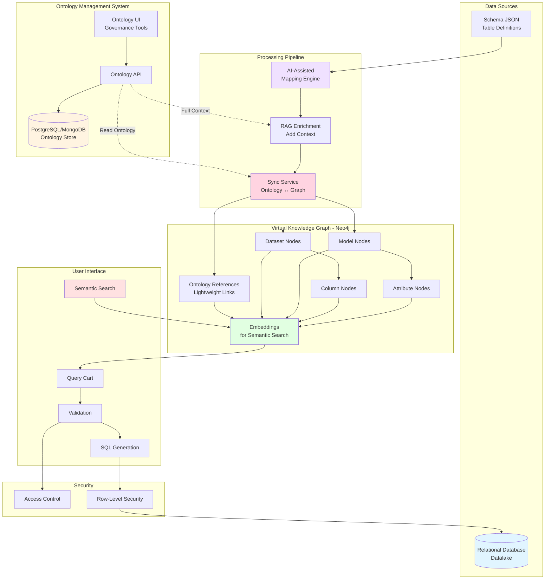
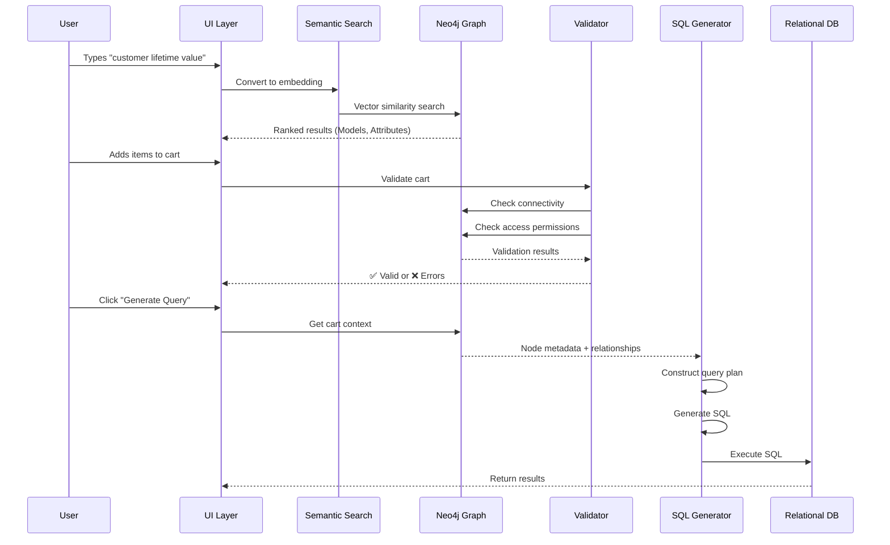
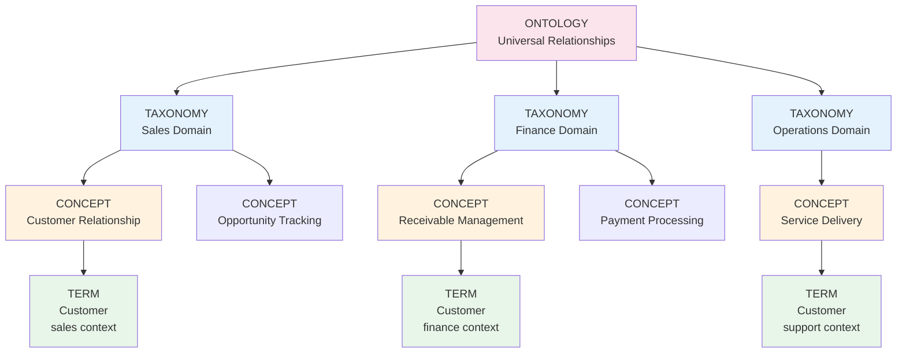
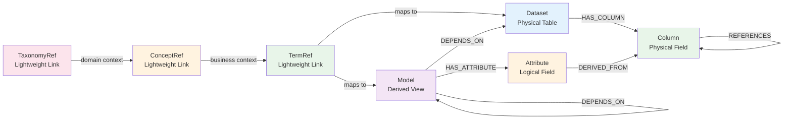
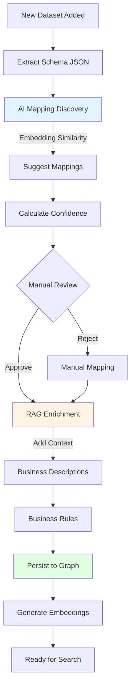
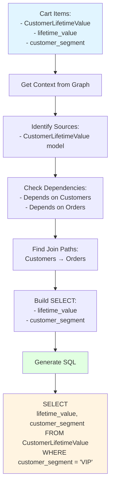
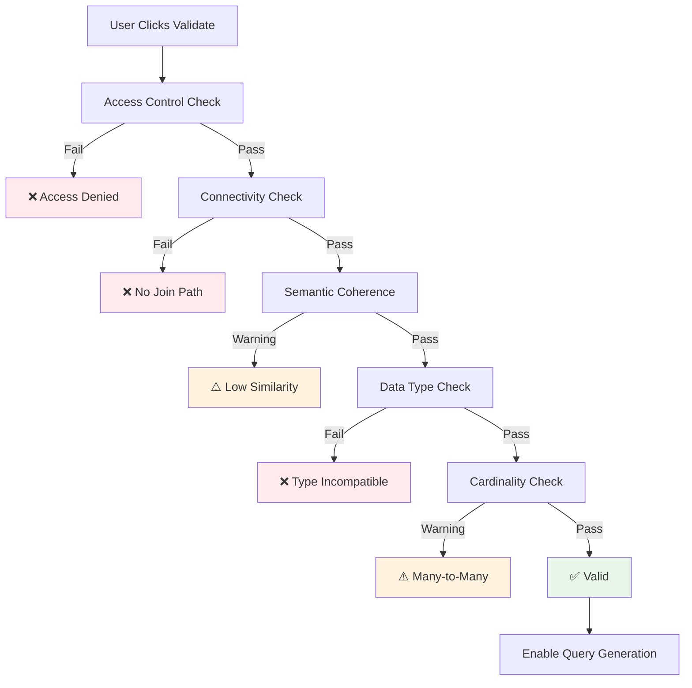
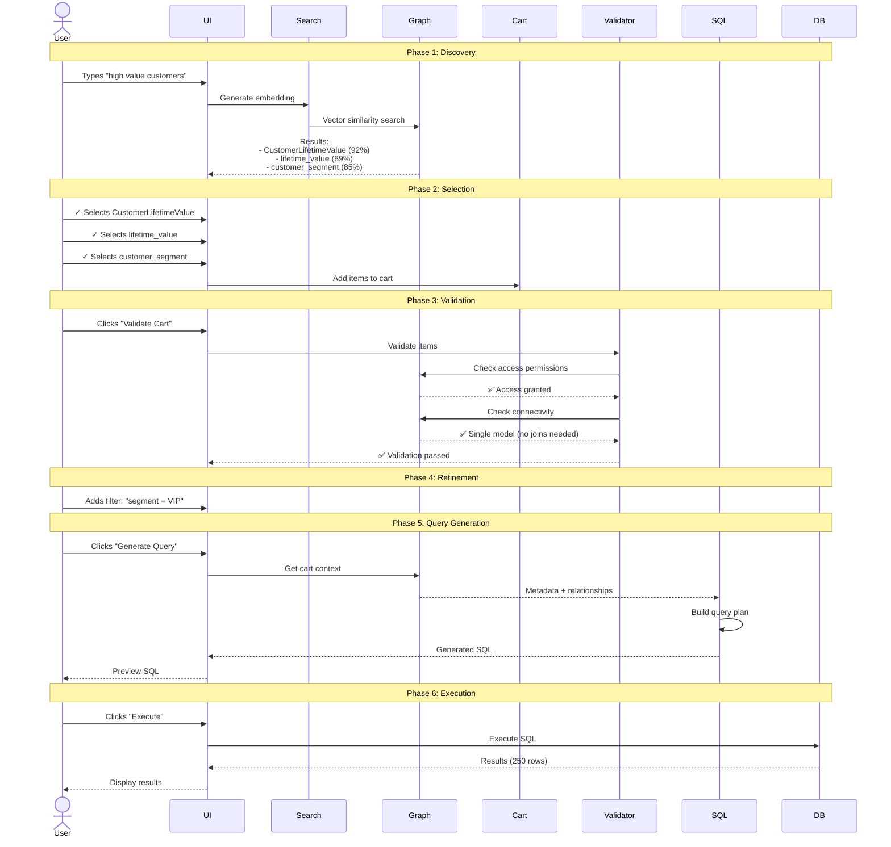

# Virtual Knowledge Graph Architecture
## Semantic Discovery & Natural Language Query System

---

## Table of Contents

1. [Executive Summary](#executive-summary)
2. [System Architecture](#system-architecture)
3. [Core Components](#core-components)
4. [Data Model](#data-model)
5. [Ontology Management](#ontology-management)
6. [Mapping & Enrichment Pipeline](#mapping--enrichment-pipeline)
7. [Graph Population](#graph-population)
8. [Semantic Discovery System](#semantic-discovery-system)
9. [Query Construction](#query-construction)
10. [Validation & Access Control](#validation--access-control)
11. [Complete User Journey](#complete-user-journey)
12. [Key Design Decisions](#key-design-decisions)
13. [Integration with Data Catalog](#integration-with-data-catalog)
14. [Benefits & Use Cases](#benefits--use-cases)
15. [Future Enhancements](#future-enhancements)

---

## Executive Summary

### The Problem

Business users struggle to query relational databases because:
- They don't know SQL
- They don't understand table schemas or join relationships
- Data is scattered across multiple tables and systems
- Column names are cryptic (e.g., `CUST_ID`, `ORD_DT`)

### The Solution

A **Virtual Knowledge Graph (VKG)** system that:
1. **Captures business semantics** through ontologies
2. **Maps technical schemas** to business concepts
3. **Enables semantic search** to discover relevant data
4. **Constructs SQL automatically** from user selections
5. **Validates queries** before execution
6. **Enforces access control** at dataset/column level

### Key Innovation

The graph stores **only metadata** (structure, relationships, semantics), not actual data. Real data stays in the relational database. The graph acts as a **semantic index** that translates natural language queries into SQL.

---

## System Architecture



### System Flow



---

## Core Components

### 1. Ontology Management System
- **Technology**: PostgreSQL or MongoDB (separate from graph)
- **Purpose**: Central repository for business ontologies with governance
- **Contains**: 
  - **Taxonomies**: Domain organization (Sales, Finance, Operations)
  - **Concepts**: Business areas within domains (Customer Relationship, Receivable Management)
  - **Terms**: Vocabulary with definitions, synonyms, and usage context
  - **Approval Workflows**: Status tracking, version history, data stewardship
- **Access**: Governance teams manage via dedicated UI and standard SQL tools
- **Key Benefit**: Ontology can be managed independently without affecting the knowledge graph

### 2. Metadata Layer
- **Purpose**: Describe actual database structure
- **Format**: JSON Schema
- **Contains**: Tables, columns, data types, foreign keys

### 3. Mapping Engine
- **Purpose**: Connect ontology concepts to database elements
- **Method**: AI-assisted with manual override
- **Output**: Mapping configuration linking datasets to ontology terms (by reference ID)

### 4. Sync Service
- **Purpose**: Keep ontology references synchronized between systems
- **Method**: Watches ontology changes, updates lightweight references in Neo4j
- **Triggers**: Regenerates embeddings when ontology definitions change

### 5. Virtual Knowledge Graph
- **Technology**: Neo4j
- **Purpose**: Semantic index over relational data with lightweight ontology links
- **Contains**: 
  - Lightweight ontology references (IDs + cached names)
  - Dataset/Model/Column metadata
  - Mappings (ontology_id → physical tables)
  - Embeddings for semantic search
- **Does NOT Contain**: Full ontology definitions (stored in separate system)

### 6. Semantic Search
- **Technology**: Vector embeddings (Sentence Transformers / OpenAI)
- **Purpose**: Find relevant data by meaning using domain-aware context
- **Searches**: Dataset names, column descriptions, enriched with full ontology hierarchy

### 7. Query Constructor
- **Purpose**: Build SQL from selected graph nodes
- **Method**: Graph traversal to find join paths via foreign key relationships
- **Output**: Optimized, validated SQL query

### 8. Validators
- **Connectivity Validator**: Ensures selected items are joinable via FK relationships
- **Access Control Validator**: Enforces user permissions at dataset/column level
- **Semantic Coherence Validator**: Warns about semantically unrelated items

---

## Data Model

### Ontology Hierarchy (Stored in PostgreSQL/MongoDB)



**Key Concepts:**
- **TAXONOMY**: Domain-level organization (WHERE - Sales, Finance, Operations)
- **CONCEPT**: Business areas within domains (WHAT - Customer Relationship, Receivable Management)
- **TERM**: Vocabulary with context-specific definitions (Customer in sales ≠ Customer in finance)

### Graph Node Types (Stored in Neo4j)



### Node Structures (Key Properties Only)

```javascript
// Ontology Store (PostgreSQL/MongoDB)
Taxonomy {
    id: "uuid",
    name: "Sales Domain",
    description: "Sales and customer relationship management",
    owner: "Chief Revenue Officer",
    governance_body: "Sales Data Council",
    status: "approved"
}

Concept {
    id: "uuid",
    taxonomy_id: "uuid-ref",
    label: "Customer Relationship",
    business_area: "Revenue Generation",
    steward: "VP of Sales",
    status: "approved"
}

Term {
    id: "uuid",
    concept_id: "uuid-ref",
    preferred_term: "Customer",
    definition: "Individual or organization that purchases products or services",
    synonyms: ["Client", "Buyer", "Purchaser"],
    usage_context: "Used in sales, marketing, and CRM contexts",
    governance_status: "approved"
}

// Neo4j Graph (Lightweight References)
TaxonomyRef {
    ontology_id: "uuid-from-postgres",
    name: "Sales Domain",  // Cached for display
    embedding: [0.123, -0.456, ...]
}

TermRef {
    ontology_id: "uuid-from-postgres",
    preferred_term: "Customer",
    concept_id: "uuid-ref",
    definition_summary: "Individual or org...",  // Short version
    embedding: [0.234, -0.567, ...]
}

Dataset {
    name: "Customers",
    type: "table",
    database: "northwind",
    mapped_to_term: "uuid-from-postgres",  // Link to ontology
    description: "Customer master data",
    tags: ["customer", "master data"],
    embedding: [0.345, -0.678, ...]
}

Column {
    name: "CustomerID",
    dataType: "varchar(5)",
    isPrimaryKey: true,
    mapped_to_property: "uuid-from-postgres",  // Link to ontology
    description: "Unique customer identifier",
    embedding: [0.456, -0.789, ...]
}

// Relationship Properties (FK)
REFERENCES {
    constraintName: "FK_Orders_Customers",
    joinCondition: "Customers.CustomerID = Orders.CustomerID",
    cardinality: "one-to-many"
}
```

---

## Ontology Management

### Ontology Storage Architecture

**Separate System Approach:** Ontology definitions are stored in PostgreSQL/MongoDB, separate from the Neo4j knowledge graph. This enables:
- Independent governance workflows
- Standard SQL/NoSQL tooling for ontology management
- Easy version control and audit trails
- Integration with enterprise data catalogs
- Neo4j stays lightweight with only reference links

### Ontology Structure (Multi-Domain)

```json
{
  "@context": {
    "@vocab": "http://enterprise.com/ontology#"
  },
  "ontology": {
    "name": "Enterprise Business Ontology",
    "version": "1.0",
    "domains": ["Sales", "Finance", "Operations", "HR"]
  },
  
  "taxonomies": [
    {
      "id": "sales_taxonomy",
      "name": "Sales Domain",
      "description": "Sales and customer relationship management",
      "owner": "Chief Revenue Officer",
      "governance_body": "Sales Data Council"
    },
    {
      "id": "finance_taxonomy",
      "name": "Finance Domain", 
      "description": "Financial operations and accounting",
      "owner": "Chief Financial Officer",
      "governance_body": "Finance Data Council"
    }
  ],
  
  "concepts": [
    {
      "id": "customer_relationship",
      "label": "Customer Relationship",
      "taxonomy": "sales_taxonomy",
      "description": "Entities and processes related to customer interactions",
      "business_area": "Revenue Generation",
      "steward": "VP of Sales",
      "related_concepts": ["prospect_management", "opportunity_tracking"]
    },
    {
      "id": "receivable_management",
      "label": "Receivable Management",
      "taxonomy": "finance_taxonomy",
      "description": "Entities that owe money to the organization",
      "business_area": "Accounts Receivable",
      "steward": "Controller"
    }
  ],
  
  "terms": [
    {
      "id": "customer_sales",
      "preferred_term": "Customer",
      "concept": "customer_relationship",
      "definition": "Individual or organization that purchases products or services",
      "synonyms": ["Client", "Buyer", "Purchaser"],
      "usage_context": "Used in sales, marketing, and CRM contexts",
      "examples": ["ALFKI - Alfreds Futterkiste"],
      "governance_status": "approved",
      "last_reviewed": "2024-01-15"
    },
    {
      "id": "customer_finance",
      "preferred_term": "Customer",
      "concept": "receivable_management",
      "definition": "Entity with an accounts receivable balance",
      "synonyms": ["Account", "Debtor"],
      "usage_context": "Used in finance, accounting, and collections",
      "governance_status": "approved"
    }
  ]
}
```

### Ontology Database Schema (PostgreSQL Example)

```sql
-- Core Tables
CREATE TABLE taxonomies (
    id UUID PRIMARY KEY,
    name VARCHAR(255),
    description TEXT,
    owner VARCHAR(255),
    status VARCHAR(50),  -- draft, approved, deprecated
    created_at TIMESTAMP,
    updated_at TIMESTAMP
);

CREATE TABLE concepts (
    id UUID PRIMARY KEY,
    taxonomy_id UUID REFERENCES taxonomies(id),
    label VARCHAR(255),
    description TEXT,
    business_area VARCHAR(255),
    steward VARCHAR(255),
    status VARCHAR(50)
);

CREATE TABLE terms (
    id UUID PRIMARY KEY,
    concept_id UUID REFERENCES concepts(id),
    preferred_term VARCHAR(255),
    definition TEXT,
    usage_context TEXT,
    synonyms TEXT[],
    governance_status VARCHAR(50),
    last_reviewed DATE
);

-- Governance Tables
CREATE TABLE term_approvals (
    id UUID PRIMARY KEY,
    term_id UUID REFERENCES terms(id),
    submitted_by VARCHAR(255),
    reviewed_by VARCHAR(255),
    status VARCHAR(50),  -- pending, approved, rejected
    comments TEXT
);

CREATE TABLE term_versions (
    id UUID PRIMARY KEY,
    term_id UUID REFERENCES terms(id),
    version VARCHAR(50),
    definition TEXT,
    changed_by VARCHAR(255),
    changed_at TIMESTAMP
);
```

### Sync Process

**Ontology → Neo4j Synchronization:**
When ontology definitions change in PostgreSQL/MongoDB, a sync service:
1. Detects changes via database triggers or polling
2. Fetches full ontology context (taxonomy → concept → term)
3. Generates rich embeddings using hierarchical context
4. Updates lightweight references in Neo4j
5. Invalidates cached embeddings that depend on changed terms

---

## Mapping & Enrichment Pipeline

### Pipeline Flow



### AI-Assisted Mapping

**Discover Mappings:** Generate embeddings for both database tables and ontology terms, then calculate semantic similarity. Propose mappings where similarity exceeds threshold (e.g., 0.7), ranked by confidence score.

**Enrich Mappings:** Use RAG and LLM to add business context, common use cases, data quality rules, and related concepts for each discovered mapping. This enrichment feeds into embedding generation for better semantic search.

### Mapping Configuration Output

```json
{
  "mapping_id": "map_001",
  "source_table": "Customers",
  "ontology_term_id": "uuid-from-ontology-store",
  "confidence": 0.98,
  "status": "confirmed",
  "enrichment": {
    "business_context": "Primary source for customer relationship management",
    "use_cases": ["Customer segmentation", "Sales analysis"],
    "quality_rules": ["CustomerID must be unique", "CompanyName required"]
  },
  "column_mappings": [
    {
      "column": "CustomerID",
      "ontology_property_id": "uuid-from-ontology-store",
      "confidence": 1.0,
      "transformation": "direct"
    },
    {
      "column": "CompanyName",
      "ontology_property_id": "uuid-from-ontology-store",
      "confidence": 0.99,
      "transformation": "direct"
    }
  ]
}
```

---

## Graph Population

### Creating Virtual Graph Metadata

**Populate Dataset:** Create dataset node with metadata and business context from enrichment. For each column, create column node and link to dataset via HAS_COLUMN relationship. If column is a foreign key, create REFERENCES relationship to target column with join metadata (constraint name, join condition, cardinality).

**Create Ontology Mappings:** Link dataset to ontology term (by UUID reference to ontology store). Map each column to corresponding ontology property (also by UUID reference). Store confidence scores and mapping metadata for traceability.

### Example: Northwind Graph

```cypher
// Customers Dataset
CREATE (ds_customers:Dataset {
  name: "Customers",
  sourceSystem: "Northwind_DB",
  mapped_to_term: "uuid-from-ontology-store",
  description: "Customer master data",
  tags: ["customer", "CRM"]
})

// Customer Columns
CREATE (col_custid:Column {
  name: "CustomerID",
  dataType: "varchar(5)",
  isPrimaryKey: true,
  mapped_to_property: "uuid-from-ontology-store"
})

CREATE (col_company:Column {
  name: "CompanyName",
  dataType: "varchar(40)",
  mapped_to_property: "uuid-from-ontology-store"
})

CREATE (ds_customers)-[:HAS_COLUMN]->(col_custid)
CREATE (ds_customers)-[:HAS_COLUMN]->(col_company)

// Orders Dataset
CREATE (ds_orders:Dataset {
  name: "Orders",
  sourceSystem: "Northwind_DB",
  mapped_to_term: "uuid-from-ontology-store"
})

CREATE (col_orderid:Column {
  name: "OrderID",
  dataType: "int",
  isPrimaryKey: true
})

CREATE (col_cust_fk:Column {
  name: "CustomerID",
  dataType: "varchar(5)",
  mapped_to_property: "uuid-from-ontology-store"
})

CREATE (ds_orders)-[:HAS_COLUMN]->(col_orderid)
CREATE (ds_orders)-[:HAS_COLUMN]->(col_cust_fk)

// FK Relationship (stores join logic)
CREATE (col_cust_fk)-[:REFERENCES {
  constraintName: "FK_Orders_Customers",
  joinCondition: "Orders.CustomerID = Customers.CustomerID",
  cardinality: "many-to-one"
}]->(col_custid)

// Lightweight Ontology Reference (cached for display)
CREATE (term_ref:TermRef {
  ontology_id: "uuid-from-ontology-store",
  preferred_term: "Customer",
  concept_id: "uuid-of-concept",
  definition_summary: "Individual or organization...",
  embedding: [0.234, -0.567, ...]
})

CREATE (ds_customers)-[:MAPPED_TO_TERM]->(term_ref)
```

---

## Semantic Discovery System

### Embedding Generation

**Generate Node Embedding:** Combine multiple fields from node and its full ontology hierarchy to create rich semantic context. For a dataset node, fetch the complete path (Taxonomy → Concept → Term) from ontology store, then concatenate: domain name, business area, concept description, term definition, synonyms, usage context, steward information, dataset metadata, and column names. Encode this enriched text using transformer model to generate 384-dimensional embedding vector.

**Embed All Nodes:** Query graph for all searchable nodes (Dataset, Model, Column, Attribute) without embeddings. For each node, traverse to ontology store via reference ID to fetch full hierarchical context, generate embedding, and store in graph node.

### Semantic Search

**Search Process:** Generate embedding for user's query text. Search Neo4j graph for nodes with embeddings, calculate cosine similarity between query embedding and node embeddings, filter by similarity threshold (>0.5), optionally filter by node type or domain tags, and return top-k results ordered by similarity score.

**Domain-Aware Search:** Users can filter results by their preferred domain (e.g., "Sales" vs "Finance"). This disambiguates terms like "Customer" that have different meanings across business contexts. Search includes full hierarchy context for explainability.

### Search Results Example

**User Query:** "customer lifetime value"

**Results:**
```json
[
  {
    "node_id": 123,
    "node_type": "Model",
    "name": "CustomerLifetimeValue",
    "description": "Calculates CLV based on purchase history",
    "similarity": 0.92,
    "tags": ["CLV", "metrics", "customer"],
    "domain": "Sales Domain",
    "ontology_term": "Customer (sales context)"
  },
  {
    "node_id": 456,
    "node_type": "Attribute",
    "name": "lifetime_value",
    "description": "Total predicted customer value",
    "similarity": 0.89,
    "parent_name": "CustomerLifetimeValue",
    "domain": "Sales Domain"
  }
]
```

---

## Query Construction

### Query Cart System

**Cart Structure:** Maintains list of selected node IDs from search results. 

**Get Context:** Query graph to retrieve full metadata for cart items including parent datasets/models, dependency chains (via DEPENDS_ON relationships), and foreign key relationships (via REFERENCES edges with join conditions).

### SQL Generation

**Generate SQL:** Identify primary source table/model from cart items. Build SELECT clause from selected columns/attributes. Find shortest join paths between sources using graph traversal over REFERENCES relationships. Construct WHERE clause from user filters. Assemble complete SQL with proper JOIN syntax and conditions. Optionally validate and optimize using SQLGlot.

### Query Construction Flow



---

## Validation & Access Control

### Validation System



### Connectivity Validator

**Validate Connectivity:** Query graph to find parent datasets/models for all cart items. If single source, return INFO (no joins needed). For multiple sources, check each pair for existence of join path using shortest path algorithm over REFERENCES and DEPENDS_ON relationships. If any pair is disconnected, return ERROR with details. Otherwise return INFO (all items joinable).

**Check Join Path:** Use Cypher shortest path query to find connection between two sources via foreign key relationships (REFERENCES edges) or model dependencies (DEPENDS_ON edges). Return true if path exists.

### Access Control System

**Validate Access:** Fetch user's permissions from graph (roles and allowed resources via HAS_ROLE and HAS_POLICY relationships). For each cart item, check if user has access to parent resource. Check for column-level restrictions (e.g., PII fields require special permission). Return ERROR with denied items if any access violations found.

**Get User Permissions:** Query graph for user node, traverse to roles and policies, collect all resources user can access via GRANTS_ACCESS_TO relationships. Also collect any restricted resources via RESTRICTS_ACCESS_TO relationships.

### Access Control Graph Structure

```cypher
// User and Role
CREATE (user:User {
  userId: "john.doe@company.com",
  name: "John Doe",
  department: "Sales"
})

CREATE (role:Role {
  roleId: "sales_analyst",
  name: "Sales Analyst"
})

CREATE (user)-[:HAS_ROLE]->(role)

// Access Policy
CREATE (policy:AccessPolicy {
  policyId: "policy_001",
  resourceType: "Dataset",
  action: "READ",
  effect: "ALLOW"
})

CREATE (role)-[:HAS_POLICY]->(policy)
CREATE (policy)-[:GRANTS_ACCESS_TO]->(ds:Dataset {name: "Customers"})

// PII Restriction
CREATE (pii_policy:AccessPolicy {
  policyId: "policy_002",
  resourceType: "Column",
  action: "READ",
  effect: "DENY",
  reason: "Contains PII"
})

CREATE (pii_policy)-[:RESTRICTS_ACCESS_TO]->(col:Column {name: "SSN"})
```

---

## Complete User Journey

### End-to-End Flow



### Example Session

**Step 1: User Search**
```
User: "show me high value customers"

Search Results:
✓ Model: CustomerLifetimeValue (92% match)
  "Calculates customer lifetime value metrics"
  
✓ Attribute: lifetime_value (89% match)
  "Total predicted customer value"
  
✓ Attribute: customer_segment (85% match)
  "Calculated segment: VIP, Active, At Risk"
```

**Step 2: Cart Selection**
```
Cart (3 items):
├─ CustomerLifetimeValue (Model)
├─ lifetime_value (Attribute)
└─ customer_segment (Attribute)
```

**Step 3: Validation**
```
Validating cart...

✅ Access Control: Passed
   - User has access to CustomerLifetimeValue model
   
✅ Connectivity: Passed
   - All attributes from same model (no joins needed)
   
✅ Data Types: Passed
   - All fields compatible
   
⚠️  Note: customer_segment is categorical (values: VIP, Active, At Risk)
```

**Step 4: Query Generation**
```
Graph Analysis:
├─ Source: CustomerLifetimeValue (Model)
├─ Dependencies: Customers, Orders (auto-handled by model)
├─ Attributes: 2 selected
└─ Joins: None needed (single model)

Generated SQL:
┌────────────────────────────────────────────┐
│ SELECT                                     │
│   customer_id,                             │
│   lifetime_value,                          │
│   customer_segment                         │
│ FROM CustomerLifetimeValue                 │
│ WHERE customer_segment = 'VIP'             │
│ ORDER BY lifetime_value DESC               │
└────────────────────────────────────────────┘
```

**Step 5: Execution**
```
Executing query...

Results: 47 rows returned

┌─────────────┬────────────────┬──────────────────┐
│ customer_id │ lifetime_value │ customer_segment │
├─────────────┼────────────────┼──────────────────┤
│ QUICK       │ $15,420.00     │ VIP              │
│ SAVEA       │ $14,850.50     │ VIP              │
│ ERNSH       │ $12,340.75     │ VIP              │
│ ...         │ ...            │ ...              │
└─────────────┴────────────────┴──────────────────┘
```

---

## Key Design considerations

### 1. Separation of Concerns

**Ontology Storage:** PostgreSQL/MongoDB separate from Neo4j
- **Rationale**: Enables independent governance workflows, standard SQL tooling, easy version control
- **Benefit**: Governance teams manage ontology without touching knowledge graph
- **Trade-off**: Requires sync service to keep systems aligned

**Graph Storage:** Lightweight ontology references only
- **Rationale**: Neo4j optimized for relationship traversal, not full ontology management  
- **Benefit**: Graph stays fast and focused on metadata and search
- **Trade-off**: Must fetch full ontology details from separate system when needed

### 2. Multi-Domain Architecture

**Hierarchical Ontology:** Taxonomy → Concept → Term
- **Rationale**: Same term ("Customer") has different meanings across domains
- **Benefit**: Domain-aware search provides accurate, contextual results
- **Trade-off**: More complex structure requires careful governance

**Embeddings with Full Context:** Include complete hierarchy in embedding generation
- **Rationale**: Richer context improves semantic search accuracy
- **Benefit**: Better disambiguation and relevance ranking
- **Trade-off**: Embeddings must be regenerated when ontology changes

### 3. Knowledge Graph Pattern

**Metadata Only:** Graph stores structure, not actual data
- **Rationale**: Data volume would overwhelm graph, relational DB optimized for data storage
- **Benefit**: Single source of truth for data, graph remains lightweight
- **Trade-off**: Must execute generated SQL on source database

**Foreign Keys as Edges:** Store FK relationships as graph edges, not properties
- **Rationale**: Graph databases excel at relationship traversal
- **Benefit**: Fast join path discovery, natural graph semantics
- **Trade-off**: More relationship types to manage

### 4. SQL Validation & Optimization

**SQLGlot Integration:** Parse, validate, optimize before execution
- **Rationale**: Catch errors early, improve query performance, support multiple dialects
- **Benefit**: Transpile between SQL dialects, apply optimization patterns
- **Trade-off**: Additional processing step before execution

---

